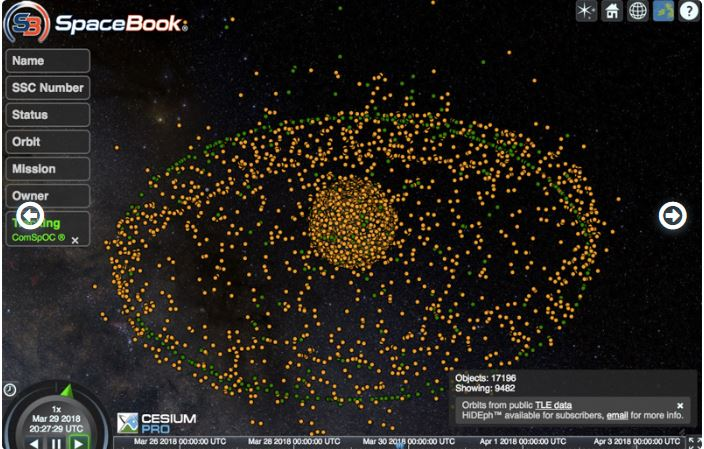
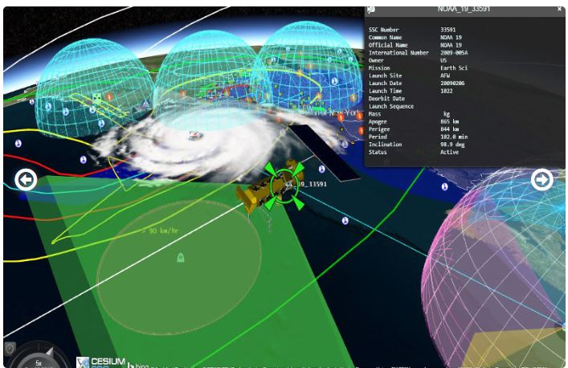
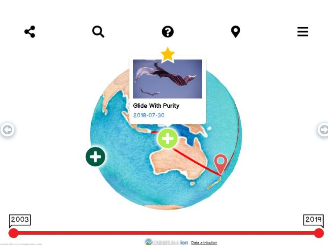

[https://cesiumjs.org/demos/](https://cesiumjs.org/demos/)

[ Where Were They?]()

## 3D Tiles

##  Space

## Defense

## Smart Cities

## Geospatial

## Meteorology

## History

##  Aircraft and Drones

## Maritime

##  Sports and Entertainment

---

### Where Were They?

行程绘图仪是一种应用程序，用于直观显示从19世纪中叶开始的第一次世界大战时期的皇家海军船只和美国船只的北极航行。
对于给定的一天，用户可以看到船的位置并阅读描述船上活动的日志条目。这些日志已由“旧天气”项目的志愿者转录，并由“海军历史网”项目的志愿者编辑成更易读的形式。
他们在哪里？使用CesiumJS显示第一次世界大战期间皇家海军舰艇的位置。这些舰艇是动画的，允许游客观看全球各地舰艇的运动，并看到这是一场真正的全球战争，而这场战争不仅是在比利时和法国的战壕中进行的。
船舶位置来自czml文件，其中包含数百艘船的中午位置。为了减小文件大小，在加载czml文件后动态生成船舶的点和标签。CesiumViewer小部件针对该站点进行了调整，包括修改后的动画小部件和搜索船名的地理编码程序。

### Red Bull X-Alps 2019

[https://cesiumjs.org/demos/xalps/](https://cesiumjs.org/demos/xalps/)

2019年红牛X-阿尔卑斯山是一个激烈的，跨阿尔卑斯山的多天徒步和滑翔比赛。虽然运动员的路径比这要走得更远，但比赛路线却以直线覆盖了1000多公里。
鉴于崎岖的地形和滑翔飞行构成了这场比赛，三维可视化对于理解比赛至关重要。2019年红牛X-阿尔卑斯山的球迷可以用CesiumJS进行3D比赛。通过CesiumJS应用程序，球迷可以在线跟踪比赛，查看运动员的进步并监控他们的排名。

### CyberCity 3D
High-resolution streaming "smart" 3D buildings for GIS.

Cybercity 3D，Inc.，A Southern California-based Geospatial Modeling and Mapping Company，creates high resolution building models using its patented 3D modeling software.这些“智能”模型以测量数据为基础，如高度、斜坡等，并以6-Inch精度为基础，为地球空间分析的各种应用制作了无损工具。
电脑城三维大楼优化了铯流，将三维引入公共和私人项目，包括规划和分析、土地、经济发展和洪水风险减缓。Cybercity's 3d models work interactively.建筑物，根据需求加强，以视野为基础，可以与卫星图像、地形和矢量数据相结合。用户可以高清晰的个体建筑物，并点击它们以获取元数据。
电子城市3D的浏览器-基于图形的解决方案在所有环境中工作，包括移动。此外，CC3D Boasts the World's Largest Building Library of its kind，with more than 1500平方公里的覆盖面积and more than 150万building s.
顾客可以订购离岸外壳模型，并通过三维网络城SAAS定制新建筑物，街道城市数据全部输入铯。这些模型可以导出到最多的文件格式，包括Collada、Godatabase、Shapefile、DXF、KML、SKP、FBX和OBJ。Cybercity 3D's exported collada models are converted into GLTF，then streamed using 3D tiles with vector data delivered as Geojson.
网络城3D与下一个空间建立了伙伴关系，一个内容管理系统，使铯的工作更加坚固。随着下一空间的加入，铯使用者可以阻挡和减少更多的图像、文件、链接、报告和视频进入CC3D大楼。上传和浏览文档、图像和照片与任何资产相关，以及全部详细的建筑标记模型。钻到任何视觉或数据详细水平。
See samples of 3D cybercity buildings at work with cesium from Los Angeles，Phoenix，Paris France，Boston Ma，and Oakland CA.

### ComSpOC™
商业空间运行中心是一个空间态势感知（SSA）设施，融合了不断增长的全球商业传感器网络的卫星跟踪测量。

商业空间运行中心（Comspoc™）是由分析图形公司（Agi）开发的空间态势感知（SSA）设施，用于跟踪空间物体，以监测威胁并维持空间安全。它跟踪数万颗卫星，包括那些公开上市和未上市的卫星。
利用全球商业传感器网络，包括光学、雷达、主动射频和被动射频，COMSPOC融合了这些卫星跟踪测量，并提供了广泛的分析和处理能力。
COMSPOC的可视化是建立在铯和系统工具包（STK）组件库之上的。通过Spacebook，用户可以与来自Comspoc的SSA数据进行交互。这个交互式的、基于网络的卫星查看器显示了15000多个空间物体，几乎是实时更新的。

### Historic Pharsalia Cabin Point Cloud Using Cesium & 3D Tiles
使用铯和3D瓷砖的历史法萨利亚小屋点云

### Eikland Energy
艾克兰能源公司为能源行业提供研究和分析，在天然气和液化天然气（LNG）、电力和可再生能源方面具有垂直专业化。维护全面的以运营为中心的行业数据库和工具，公司执行战略和竞争分析、能源市场建模和预测。
IGIS/液化天然气产品是一个完整的液化天然气商业智能解决方案，结合了现场、项目、船舶和公司数据以及所有权和合同信息。所有地点均提供实时分列流量预测和业务警报，与每日天然气管道流量和储存数据、全球天气预测、港务局和其他外部信息无缝集成。底层先进的物流系统提供贸易程序调度和计划与自适应最优船舶航线。
igis/lng使用CesiumJS作为其用户界面、快速搜索和分析和即时可视化平台的关键部分。用户可以利用多个基于大规模杀伤性武器的图像提供商，包括哥白尼哨兵-2、陆地卫星和官方导航图，与支持人工智能的业务相集成。

###  STK

系统工具包（STK）由Analytical Graphics，Inc.，（AGI）开发，是一个由数千名工程师、任务分析师和软件开发人员用来建模复杂系统的建模环境。这些系统包括飞机、导弹、卫星及其传感器。除了表示这些系统的复杂分析模型外，STK还提供了一个精确的、沉浸式的交互式三维可视化。
STK为共享一个模拟场景提供了几个选项，其中之一是将数据导出到czml文件以在铯中可视化。AGI的团队从一开始就设计了czml，因为他们找不到满足STK将时间动态数据传输到可视化系统需求的预先存在的格式。czml专门用来表示随时间变化的分析数据。czml具有显示STK复杂场景的基本构建块，包括多段线、广告牌、文本标签，甚至是3D模型。保存到czml文件的功能允许信息通过将时间动态可视化导出到Web浏览器，同时仍然支持交互，从而达到更大的访问群体。
使用STK组件开发工具包开发自定义应用程序的开发人员同样可以通过编写.NET或Java代码生成CZML在CISIUS中可视化。然而，用户与STK合作，其航空和国防相关分析可以很容易地用czml在铯中可视化。

### Swiss Federal Geoportal

瑞士联邦地理门户（geo.admin.ch）是一个联邦政府平台，促进公众访问瑞士空间数据。它包含了500多个源自各种联邦机构的地理数据集，以及20多个主题门户。geo.admin.ch是为了响应联邦地理信息法而创建的，旨在更有效地为专业人士和公众传播综合地理信息。任何需要的人都可以查看、打印和订购地理数据。该网站平均每天有50000名用户访问。
geo.admin.ch正在其查看器中使用ol-cesium javascript库，以便通过web访问map.geo.admin.ch中的三维地理数据。该查看器实现瑞士的一个大型地形景观模型swisstlm3d。它包括自然和人工景观特征，以及矢量形式的名称数据。SwissTLM3D具有很高的精度和三维融合度，是瑞士最广泛、最精确的三维矢量数据集。建筑物基于矢量数据集，该数据集将建筑物描述为具有屋顶几何结构和屋顶悬挑的三维模型。在AGI的铯团队的帮助下，这些建筑被处理成了处理引擎的开发版本，最终将作为cesium.com的一部分提供。所有三维的高层次细节、广泛的覆盖范围和建筑体积的真实呈现，使本产品成为广泛应用的宝贵基础数据集。
geo.admin.ch是由联邦地形办公室（swisstopo）运营的开放式建筑：
开源：瑞士联邦空间数据基础设施的软件栈几乎完全基于开源软件，从操作系统到应用程序级别。源代码都在Github上。
开放标准：开放标准的使用允许访问数据和数据服务，并确保地理数据的传播。
开放式访问：数据访问一方面通过开放式数据服务geo.admin.ch提供，另一方面通过提供开放式应用程序编程接口变得更容易。
云计算：使用公共云服务（iaas）避免了耗时的硬件购买。自动配置使公共机构能够在不到一小时的时间内将服务器数量增加10倍。
geo.admin.ch为核心的ol cesium代码库提供了功能，这对其他应用程序很有用。在Twitter上关注他们。

### Scenario Manager

丹佛地区政府理事会（DRCOG）召集地方政府在交通和发展领域进行合作、制定政策和分配资金。DRCOG的众多职责之一是开发数据、信息和可视化，帮助地方政府和其他利益相关者了解该地区当前和预测的情况。
DRCOG开发和部署了广泛的技术工具，包括基于Web的数据映射和可视化工具。DRCOG最近采用Cesium来处理大型数据集，并以美观的方式向最终用户（包括本地和区域规划者）展示这些数据集。Drcog最新的Cesium应用程序是Scenario Manager，它是一种城市规划工具，可帮助规划人员定义和评估替代房地产开发方案。Cesium的3D地图有助于城市规划者可视化政策和发展相关决策的潜在影响，如停车需求、建筑高度最大值和密度要求。可视化不同的假设如何影响潜在的房地产开发，包括盈利能力的限制，可以揭示规划人员、开发商和决策者可能面临的挑战和障碍。Drcog的Scenario Manager还集成了一系列开源土地利用建模工具urbansim API，以帮助规划人员评估房地产项目的盈利能力和范围。这些工具通过对未来发展场景和模式的可视化表示，帮助规划人员了解其计划和政策如何影响潜在的私人发展。
方案管理器依赖于大型、高质量的区域数据集。例如，建筑屋顶打印数据用于可视化当前条件和未来场景。这些数据是一个独特的区域数据采集项目的结果，该项目由DRCOG提供便利，由近20个合作伙伴提供资金。数据收集在丹佛地区1100平方英里的区域，使用高精度、高分辨率的数据作为来源。结果是一套详细的标准化建筑屋顶设计，用于从第一反应者到达现场时的准备到不透水表面分析，再到三维建模。屋顶图和相关数据集可免费下载，目前正在更新中。

###  Globaltimoto

自2003年以来，由英国电脑游戏开发商蒂姆·朱尔斯·赫尔（TimJulesHull）开始驾驶摩托车环游世界，记录本土游戏和体育文化。
该项目的目的是通过传统游戏了解文化，获取数据，并促进对主题的兴趣。长期目标是创建一个完全互动的本土游戏文化博物馆，无论是虚拟的、混合的还是真实的空间体验。
在他的网站上，他通过写作、素描、照片和视频记录这些传统的游戏和运动，其中包括对游戏参与者的采访。
版本1.0建于2003年，是一个冲击波三维对象与完全互动和动画三维地球仪。
2005年构建的2.0版是纯HTML/CSS，由于没有本机浏览器支持，所以没有使用3D。
2012年构想的3.0版本于2018年开始建造，但只有铯才能实现。
其目的是返回到三维表示的一个单独的旅程环游世界。他希望Stamen的水彩瓷砖组，一条代表旅程路径的折线，以及所有的标杆都覆盖在高程数据上。
在这一发展的开始，铯还不能使折线钳地面。因此，他花了一个月或更多的时间在NASA世界风号上进行试验，但由于缺乏支持和技术限制，他放弃了这个图书馆。与此同时，铯已经解决了夹地问题，因此他转而使用铯进行显影。铯勾选了他需要的所有盒子

###  Zürich 3D

Z_rich 3D在瑞士Z_rich市的Lod2中可视化3D模型。该应用程序包括一个传统的基于Openlayers的二维地图查看器，以及一个使用铯和三维瓷砖的三维查看器。
为了探索城市，用户可以在几个基本图像层之间进行选择，包括OpenStreetmap、Bing和SwissImage。在3D模式下，超过50000栋建筑被添加为3D瓷砖。建筑物可以根据高度、用途和位置进行着色。一个定制的导航小部件允许用户向每个方向移动摄像机，并调整摄像机的间距。此外，还提供了城市上空的预定航班和自动全景视图。
此应用程序经过特别调整，可用于移动设备。在Android上，可以将应用程序安装为渐进式Web应用程序（PWA），以提高性能和更好的用户体验。
在支持绝对方向传感器类（如Chrome）的移动浏览器上，应用程序的神奇窗口模式将屏幕上的可见部分设置为跟随设备的方向。同样，一个虚拟现实模式可与分割屏幕一起使用谷歌卡纸浏览。
该应用程序由Silvio Dall'Acqua构建，作为概念验证，仅使用开放源代码数据；3D模型是z_rich市开放数据目录的一部分。

### NLS 3D Historic Map Viewer

苏格兰国家图书馆通过探索地理参考地图的浏览者免费提供数百个详细的历史地理参考地图层。这些层使用maptiler构建，并使用openlayers联机显示。地理重点是苏格兰和英国，包括详细的军械调查地图，以及过去250年来其他出版商的地图。地理参考层是一个更广泛的地图图像网站的一部分，该网站提供超过220000张历史地图作为可缩放图像。
NLS 3D地图查看器利用了Openlayers铯集成库。使用两个引导滑块，第一个允许交互式控制历史地图覆盖不透明度（允许历史地图褪色以显示现代卫星或地图图像），第二个允许通过铯场景地形聚集选项控制垂直地形放大。地形的夸张对于产生更微妙的地形变化特别有用。
标准的Openlayers地图工具和选项，如地理位置、观察者服务、地图小部件（如缩放滑块、比例尺、鼠标位置等）以及选择覆盖层和背景层的能力，都已转移到三维铯历史地图查看器中，只需稍作修改。观众使用的是开源技术，这些技术已经在Github上共享，并在地理艺术历史地图在线研讨会上进行了说明。

### Deepship.AI

deepship.ai是全球船舶交通的实时可视化。Nils Koesters博士，FRSA，Datafakts有限公司的董事，对生活在海边的船只产生了浓厚的兴趣，并看着它们驶过他在苏格兰的家。
他发现了几个显示船舶流量的网站，但所有网站都是二维的。为了创建一个引人注目的船舶流量的三维视图，他在铯上定居下来。
自动识别系统（AIS）信号在船舶所在地进行广播，通过甚高频传输，任何人都可以接收到。因此，Koesters博士安装了几个AIS接收器，并通过软件定义的无线电接收到他面前的信息。然后，他找到了一个互联网共享网站，在那里，作为分享他本地订阅的回报，他可以访问所有其他流量。
在任何时候都有大约33000艘船只以6位ASCII格式发送24条不同的AIS信息。为了解码如此多的数据，他使用了一个经过修改的开源C程序。然后，他使用一个中间数据库来收集信息，这些信息向用户的Web客户机提供PHP调用的czml流。
船舶有不同的尺寸，在两个不同的主要船舶类别中有不同的使用类别。该应用程序在两个主要类中包含大约52个不同的简化GLTF模型。船舶颜色使用一个角度材料配色方案，以明亮地显示与主角度瓷砖方案。使用三维图标类型模型，以便近距离观察的用户可以立即识别，例如，A级（商用）货船或帆船。铯世界地形也被启用。二维角形图块数据从Koesters博士的服务器传输，还有一个备份的OSM光栅数据服务器。该站点不在云上运行，因为该服务是非商业性的。
由于铯允许自由层选择，用户可以选择瓷砖角材料层或铯附带的地图。此外，Koesters还支持越来越多的ESA卫星图像通过我的WMS（Web地图服务）代理流到铯中。为了保持3D负载的可管理性，客户可以从可以看到船只的摄像头中选择半径；如果摄像头视图当前在格陵兰岛，则无需在印度看到船只。船只可以通过一个角度列表进行搜索，通过一个按钮可以让用户直接飞到船的位置。
该网站还包括一个支持传单的登录页面，这样非3D用户通常可以看到该网站的内容，但内容有一个JSON拉，而不是一个连续流服务。
deepship.ai服务信息也是为其他以船舶为中心的服务派生后端的前端。科斯特博士正致力于将AIS数据与股价联系起来，因为全球80%的商业活动都是通过船舶完成的。因此域名中的人工智能。

### Resource Watch

世界资源研究所与30多个技术和数据合作伙伴共同开发了资源观察，对开放地理空间数据集进行编目和可视化。该平台收集整理的数据，以探索和发现不同环境和社会问题之间的联系。用户可以覆盖不同的数据集，创建可共享的数据可视化，制作自定义仪表盘，在资源观察博客中阅读数据洞察，并查看地球状态的近实时数据。
CESIumJS驱动行星脉冲，资源观察的交互式可视化近实时数据来自空中和地面监测系统，包括当地空气质量、温度、降水、灾害、土地利用变化等。铯的虚拟地球引擎为全球环境挑战和危害的概述提供了一个理想的起点，并邀请用户放大查看细节。可视化支持来自多个数据服务的地图块和点查询。该平台构建在一个开源代码库上，并在项目的Github repo上可用。

###  The Virtual Cities Project

虚拟城市项目以3D形式呈现丢失的历史城市景观以及相关的历史信息。利用铯，该应用程序为各种具有历史意义的建筑提供了背景。
该应用程序提供了有关建筑物历史记录的附加信息，例如历史文档和图像，它们显示在弹出窗口或单独的框架中。铯时间线允许访问者浏览网站的历史。还可以通过更复杂的城市景观进行预建、动画、引导旅游，将游客引向该景观中的重要景点。
使用编辑工具的调色板，用户可以创建自己的三维城市，并将文本和图像链接到景观功能。应用程序的实时信息框编辑器有助于内容创建过程。
该项目经过了多次迭代，一度建立在谷歌地球、谷歌地球插件以及相关的工具集和库上。随着插件和相关API的使用寿命的结束，它们迁移到铯，这为应用程序提供了更多的可能性。

### Wasatch Backcountry Skiing Map
瓦萨奇野外滑雪地图

火药在瓦萨奇山上流动，吸引了来自世界各地的滑雪者。鉴于边远地区面临雪崩风险增加，Wasatch边远地区滑雪地图的开发旨在改善边远地区滑雪者、犹他州雪崩中心和公共安全机构之间的沟通。
该地图以打印和3D在线方式提供，公布了1100多个偏远滑雪地点的常用名称。这些名字是从一些地图和指南以及对穷国专家的采访中收集的。
这款应用最初建立在谷歌地球上，移植到CesiumJS，在桌面和手机上都可以使用。交互式地图允许用户浏览高分辨率三维地形或搜索位置名称列表。每个站点包括纬度和经度，以及可选名称。这个应用程序可以很容易地链接到地点，这样滑雪者就可以分享他们计划去的地方。该应用程序还提供雪崩预警和天气信息的快速链接。

### Geology of Dorset

多赛特地质学家协会是一个非营利的自愿组织，为所有人推广多赛特和周边地区的地质。多塞特郡位于英格兰西南部，长期以来一直是地质科学的摇篮。多塞特和东德文海岸的95英里为中生代（2.5亿至6500万年前）提供了几乎完整的序列，并被宣布为联合国教科文组织世界遗产。
多塞特地图的地质学，建立在铯离子平台上，并使用铯-MJS进行可视化，融合了欧洲的数字高程模型（EU-DEM）和环境署激光雷达数据与铯世界地形。
地图图层和特征从一些权威的网络服务和数据源进行整理，包括英国地质调查局、历史英格兰、自然英格兰、苏格兰国家图书馆和多塞特环境记录中心。位置信息显示为英国国家网格参考以及经纬度坐标。坐标转换使用proj4js。

### RMSR Tracker

劳力士中海竞速追踪器在马耳他、西西里岛、斯特罗姆博利、法维格纳、潘特莱里亚和兰佩杜萨岛周围进行为期2-6天的竞速，跟踪130多艘竞速游艇。
比赛的第一个跟踪应用程序是在2010年使用flash创建的。为了庆祝劳力士中海大赛50周年，他们迁移到铯，为桌面和移动用户提供了美丽的视觉效果。
他们的GPS跟踪数据目前由YB跟踪有限公司提供。
最初的Flash跟踪应用程序和新的铯跟踪器，以及网站和种族管理后端，都是由Sven Neumann在MaxCreate的管理下构建的，MaxCreate也提供了设计和样式。

###  Simpro-scene

Simpro Scene是一个创造性的环境，它使任何行业的专家都能够在二维和三维空间中创建复杂空间过程的工作视觉模型。它允许用户快速可视化动态地理空间数据。不需要编程技能。
Simpro场景使用推理引擎根据系统规则集分析场景。Simpro Scene是跨平台、免费、开源的，集成了人工智能和地理信息系统的各种开源库。Simpro场景的核心是本体编辑器Protege，一个构建智能系统的环境。Protege为输入Simpro场景的场景和数据集开发了框图。它是用clojure编写的，客户机是用clojurescript编写的，在浏览器中工作。Simpro Scene还使用OpenMap GIS库、Rete4Frames系统外壳和许多其他开放库。
Simpro场景使用铯进行三维可视化。目前，这通常涉及到从运动物体（如火车）的指定侧显示观察者对周围世界的看法，而火车是复杂空间过程的一部分。铯的一个特殊的Web服务器在Protege中工作，并根据客户机的请求将必要的数据传递给铯客户机。
例如，Glacier Express使用Simpro场景来可视化穿过山脉的火车路线：

### POP MOVIE

流行电影是流行音乐公司提供的免费网络平台。它的目标是提供一个360°视频体验的多样化库，任何人、任何地方都可以免费获得。会员资格是免费的，因此任何人都可以加入并提交自己的360°内容。
pop movie使用铯库为提交到平台的360°视频提供基于位置的信息。这允许每个视频都有一个相应的地理位置，指示其录制位置。Pop Movie还提供铯驱动的Pop Globe，允许观众浏览来自世界各地的360°视频集。

###  DIRMAIS

数字交互式区域测绘与信息系统（Dirmais）将历史和当代地缘政治数据与地理和地图学结合起来，为分析国际危机提供了一种直观的手段。Dirmais是为研究人员、决策者和地面专业人员设计的，它汇集了来自多个来源的数据，并将这些数据叠加在历史和现代地图上，提供了有关受灾地区的可视信息，并允许用户同时比较来自不同时期和来源的数据。
Dirmais是由普林斯顿大学伍德罗威尔逊学院列支敦士登自决研究所（Lisd）的研究人员开发的。它的目的是帮助研究人员回答诸如“为什么会发生某些战争”之类的关键问题。“和”自然地理如何影响贸易或长期的冲突？“
dirmais程序最初使用google earth作为基础层。他们已经迁移到铯，因为它能够显示已编译的dirmais信息；并且具有足够的用户友好的前端，一个允许用户轻松添加或减去地理空间信息（如地图、统计数据等）的界面。

### peakery
一本登山指南。

Peakery是一个徒步旅行和攀登世界山脉的指南。它包括超过60万个峰，并且总是增加更多的峰。Peakery的3D地图允许用户根据自己的经验去寻找山峰并记录他们的旅行。
高分辨率铯世界地形图为60多万个山峰提供了三维地图可视化。每座山峰的3D地图都能帮助徒步旅行者和登山者找到通往山顶的最佳路线，因为在交互式3D中显示山脉为用户提供了重要的导航线索，使用二维地形图可以忽略这些线索。
旅行结束后，用户还可以在3D地图上分享他们的gpx轨迹，以及与Peakery全球社区的照片和故事。

### ayvri
体育活动的交互式可视化。

AYVRI最初由NICTA开发，为体育活动提供GPS日志的交互式可视化。三维可视化是用铯离子加速器建立的，地形由铯离子驱动。
Ayvri为体育赛事提供服务，从Tor des g_ants的超级马拉松，到Du Mont Blanc的超级小径，再到生命之翼的世界跑步。他们提供比赛预览场景、3D实时跟踪和赛后回放，包括比赛日照片。活动组织者可以在自己的网站和应用程序中嵌入3D场景。
个人用户还可以上传GPS跟踪日志（从智能手机或运动型GPS跟踪器），直接在网络浏览器中的3D地图上显示。他们可以一次查看多个GPS轨迹，同步视频、照片和注释，并在线共享。

###  OneSky

OneSky将基于Web的可视化与后端API分析相结合，为商用无人机运营商带来增强的飞行计划和安全分析。OneSky的UAS交通管理（UTM）平台为无人机操作员和规划者提供了一个应用程序，用于计划飞行（本地和超视距飞行），并实时监控飞行。OneSky UTM解决方案建立在AGI分析服务的基础上，为用户提供REST接口，以评估计划的或实时的飞行路线，并考虑诸如导航错误、通信链路裕度和FAA空域入侵等方面。
Cesium的3D可视化为OneSky用户带来了一定程度的态势感知，否则，如果仅依赖二维映射解决方案，这些用户将无法获得态势感知。通过3D空域体积和地形影响查看作战图，有助于用户了解将飞机引入国家空域时必须考虑的现实情况。

### GeoFS

一个免费的在线飞行模拟器，方便访问全球真实的飞行体验。

地球观测卫星大约六年前开始。随着google earth和作为一名航空（和模拟器）爱好者提供的航空图像质量的不断提高，我对没有一个飞行模拟器能很好地利用这些数据感到沮丧，并决定自己建造。geofs的目标是，而且仍然是，让用户能够在这些环境中简单地飞行，并有机会欣赏风景。随着越来越多的人开始享受它，geofs变得越来越复杂。今天，它提供了大约16架飞机，从Piper Cub到协和飞机和A380。一些飞机配备了虚拟驾驶舱渲染。
geofs是大量的多播放器：用户可以看到和与其他播放器聊天。它还包括操纵杆支持、自动驾驶仪、风力系统、声光效果、回放模式、受限空域地图和30000多条参考跑道。物理引擎的目标是尽可能现实，同时尝试保持每一个技能水平的体验愉快。
该应用程序最初建立在谷歌地球插件之上，最近才被移植到铯。移植到铯的过程相对简单。我的代码库对底层API进行了足够的抽象，以便于替换。迁移带来的最好的结果之一是geofs现在在移动平台上运行良好。运行本机Web技术也更加合乎逻辑和舒适：使用JavaScript调试器对于NPAPI插件来说是一个真正的负担，但是在使用铯时它应该是自然的。然而，一些主要的差异导致了geofs的某些部分被完全重写。例如，GoogleEarth插件中被称为“套印格式”的内容必须用本地HTML/CSS3动画替换（这是最好的）。复杂的航空仪器正采用这种技术，性能令人担忧，但最终证明非常令人满意。
铯是一个相对年轻的平台，必须处理不可避免的怪癖。但这正是开源方法真正与众不同之处：我可以轻松浏览代码来理解问题，甚至在需要时自己修复问题。当然，在不久的将来会有很大的改善和增长。API文档已经证明是非常好的，现在有很多例子可以从中获得灵感。总体性能和稳定性都非常令人满意，没有太多的优化工作。

### NASA STORM Virtual Globe
探索全球及以上的降水卫星数据。

距地球数百公里，降水卫星飞过，使用被动和主动传感器观测云层和降雨。其中一些测量大气和表面的温度，从中可以了解到当时有多少雨和雪在下落。另一些则将微波从云中反射出来，根据这些微波的返回情况来评估水滴和雪花的大小。
全球降水任务（GPM）卫星数据对天气决策和历史降水气候分析至关重要。GPM是美国国家航空航天局（NASA）和日本航空航天探索局（JAXA）之间的合作成果。它有两个主要的仪器：双频降水雷达（DPR）和gpm微波成像仪（GMI）。DPR提供了地球表面以上的雪和液态水的3D扫描。GMI观测了来自地球的微波辐射在不同频率下的亮度温度。这两个仪器结合在一起，提供了对降水率和降水类型的彻底评估，因为卫星在65N和65S纬度之间每90分钟绕地球运行一次。GPM数据可在初始卫星飞越后24至36小时内的任何地方的NASA风暴网站上获得，而近实时（NRT）数据在30分钟内输出，用于GPM微波图像（GMI）和2小时内输出，用于双频降水雷达（DPR）。
美国国家航空航天局降水处理系统（PPS）的网络分析师/开发人员马特·拉默斯（MattLammers）开发了许多系统，利用铯将这些数据三维可视化。
风暴虚拟地球
Storm虚拟地球仪允许用户在3D中探索全球降水量。数据直接从原始HDF5文件中读取，转换为JSON，并在铯中可视化，而不存储任何后处理的文件。这是由风暴网站建立在Java Tomcat服务之上的，它允许用Java编写的Servlet的创建在网上公开。StormVG执行Ajax查询，从servlet获取卫星数据。
根据正在探索的文件，storm vg为用户提供了两种不同的方法来探索降水率信息。3级降水数据（即以非轨道方式存储）只需同时显示整个网格。可以将每个网格点移到原始整数降水率值上。三级gprof文件的特点是一个卫星在一整天内收集的0.25度网格降水率数据。三级IMERG文件将来自多个卫星的信息与半小时的地面观测结合起来。二级数据（以基于轨道的方式存储），通常分辨率更高，一次可用15分钟。使用滚动元素，用户可以查看轨道的任何部分，同时相机运动和多边形都可以显示新段将出现的位置。
雷达产品（2adpr和2bcmb）提供了降水率的水平和垂直信息，因此可以在地面和通过低层大气看到数据点，从而提供有关风暴总体结构的信息。要想了解风暴虚拟地球仪有什么可能，请查看2014年10月超级台风“冯峰之眼”的gpm核心卫星的完美飞越。
风暴事件查看器
出于外展目的，PPS在风暴事件查看器中突出显示特定的高影响事件。当gpm飞越热带气旋和龙卷风爆发等新的重大事件时，该工具会经常更新。
Storm事件查看器通过HDF5二进制文件在服务器端动态生成简单的JSON文件。这些JSON文件提供纬度、经度、海拔和降水率值，CESIumJS可以从这些值生成PointPrimitive对象。由于这些事件中的一些引起了很大的关注，JSON文件有时会提前生成和存储，以最小化服务器影响并防止延迟。
为了扩大风暴事件查看器的吸引力，PPS对界面进行了调整，使其对移动/平板电脑用户更加友好，并使其能够嵌入到NASA的新闻稿和文章中。虽然它保持了用户查看单个数据点值和为上下文读取事件简要摘要的能力，但它还是为较小的屏幕精简了evmini。它运行平稳，尽管所有的点显示，因为CESIumJS是如此移动友好。EVMicro被设计为嵌入，因此它移除了所有控制，保留了一个简单的交互式可视化，突出显示卫星数据，并能够在DPR扫描中描绘冻结和液体降水。
全球降水任务（GPM）近实时（NRT）观察员
gpmnrtview可视化gpm收集的NRT数据。该管道可以有效地将gpm nrt hdf5文件处理为czml，并使这些文件可用于visuali

### Flightradar24
实时飞行跟踪服务，提供全球数千架飞机的信息。

FlightRadar24是一种飞行跟踪服务，提供有关数千次飞行的实时信息。该服务从多个来源收集数据，以显示全球飞机的实时位置，包括超过95%的商业航班。用户还可以查看每个航班的详细信息，如速度、目的地和到达时间。自2006年首次发布以来，FlightRadar24已经有了长足的发展；这个受欢迎的应用程序已经下载了3000多万次，每月访问FlightRadar24.com的次数超过4500万次。
FlightRadar24的3D视图最初是建立在谷歌地球上的，后来迁移到铯。此举使得FlightRadar24可以在更广泛的设备阵列上查看，而无需插件。
作为向铯移动的一部分，FlightRadar24开发了一个更具沉浸感的3D视图。除了提供驾驶舱视图外，新的3D视图还允许用户从飞机外部跟踪航班，飞机由3D模型表示。在Github上以gltf格式查看他们的飞机模型。用户可以从任何角度进行平移和缩放以查看航班，并可以观看下面经过的详细风景。

### FodarEarth™

使用FODAR收集的5-20cm图像和地形的可视化工具。

过去20年来，阿拉斯加费尔班克斯大学的研究教授马特·诺兰博士一直在研究和设计捕捉地形和图像的新方法。其结果是FODAR，一种能够捕获5-20厘米分辨率的低成本技术。
平面
诺兰博士的公司Fairbanks Fodar将Fodarearth从Skyline移植到Cesium，以便为客户提供项目访问权限，而无需安装任何附加软件或浏览器插件。
技术
在10厘米的分辨率下，FODAR产生的点云大约为每平方公里7GB。为了使Fairbanks的客户能够在任何需要的细节级别上查看他们的项目，Fodarearth使用Cesium的细节级别，在各种缩放级别上提供图像和地形，分辨率高达5厘米（24级）。
Fodarearth依靠三个独立的托管服务无缝地为浏览器提供图像和地形。必应地图提供了基本地图图像，亚马逊的S3服务托管了由Fodar生成的高分辨率图像，作为平铺地图服务（TMS），以及AGI的STK Terrain Server，它们都将高分辨率DEM预处理为优化的网格，并托管数据以供在应用程序中使用。
福特诺克斯金矿
福特诺克斯金矿是一个很好的例子细节FODAR捕捉。当我们放大矿井时，我们开始看到岩石和巨石不仅仅是图像，而是地形特征。

### Nokia SI Suite
高级分析应用程序平台。
诺基亚企业、分析和物联网（前Spacetime Insight）将铯作为SI套件平台的组成部分。公用事业和运输等资产密集型行业的公司部署SI套件来管理和优化其资产。分析框架中的一个显著特征是基于CESIumJS的地图窗口。该窗口支持多个基础地图提供程序和一大组可视化功能来描绘二维和三维数据，如屏幕截图所示。
SI套件包括基于Java/Tomcat的服务器基础设施（SI套件服务器）、基于HTML5的应用程序查看器框架（SI套件查看器）和完整的基于Eclipse的应用程序开发环境（SI Studio Studio）。Studio应用了一种可视化编程范式，使其能够直观地创建可视化/分析应用程序，包括使用铯的地图可视化。
Si套件的早期版本支持Google Earth API和浏览器插件，但由于Google已经淘汰了这两种插件，CesiumJS被选为最具视觉兼容性的3D地图框架，确保了客户的顺利过渡。CESIumJS的开源特性还提供了无限的选项，可以根据需要探索对核心铯的扩展或集成。
进一步了解诺基亚SI套件。

### Hiroshima Archive
广岛原子弹的档案及其对周围社区的影响。

原子弹落在广岛和长崎已经70年了。今天的幸存者很少，很快就没有了。那么，谁能从个人的经验中谈论核战争对人类的影响呢？
结合多种来源的材料，广岛档案馆提供了一个全面的说明广岛爆炸和随后的后果。广岛档案馆的目标是确保后代能够了解原子战的真正成本。
技术
使用铯，档案馆能够提供个性化的体验。用户可以在浏览幸存者的帐户和照片的同时查看1945年的地图。然后他们可以选择切换到现代航空摄影，看看从那时起位置是如何变化的。
存档还提供了查看现有历史数据的新方法。我们能够执行的新分析的一些示例包括：
受影响时受害者的分布
现场照片的地理参考
影响与周围地区演变的地理关系。
从Google Earth API迁移
广岛档案馆的第一个版本是使用GoogleEarthAPI构建的。它于2011年推出，在接下来的4年里，来自世界各地的人们访问了大约30万次。一年前，谷歌宣布，他们将在2015年底否决谷歌地球API。我们不想使用不受支持的API，所以我们决定将存档迁移到铯。
在这项工作之前，我们团队中没有人有过铯的使用经验，这使得迁移过程就像探索新的特征可能性一样成为特征端口的直接特征。这导致了一些困难，因为我们将我们的KML转换为CZML，但我们通过了这一过程，并对结果非常满意。
让我们兴奋的一个值得注意的特点是，我们现在能够收集大量开放地图和地形数据。利用大冢的铯库，我们可以创建历史航空摄影和地图，并将其转换为可过滤的图像层。我们还将日本地理空间信息局保存的DEM文件集成到地形层中，以供存档使用。

### Mars Trek

这是一款既支持科学家又支持爱好者探索火星的应用程序。

有了Marstrek，用户可以探索火星地形：飞越7万英尺高的奥林巴斯蒙斯山；飞越2500英里长、4英里深的瓦尔斯马里纳里斯峡谷；沿着火星漫游者的路径飞行；探索未来火星着陆地点的位置。
已经添加了预定义的书签，可以让用户飞到表面上的各个兴趣点。加载新数据集时将添加其他书签。工具可用于计算太阳角、测量包括地形高程在内的表面特征以及生成可发送到3D打印机的STL。
该软件是使用AGI的铯javascript库和ESRI的Arcgis构建的。我们以前用Adobe Flash构建了一个月球数据查看器。WebGL的广泛采用，包括GPU加速，使我们将应用程序移植到这个框架中。数据服务器公开了OGC接口，并托管在Amazon的EC2网络上。

