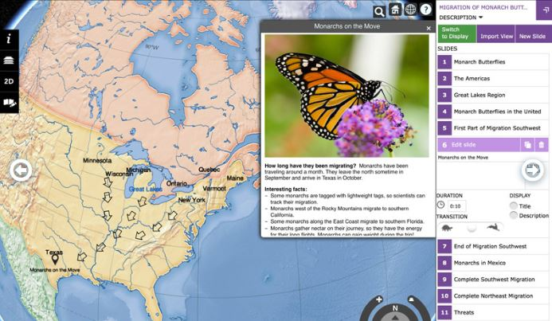

[https://cesiumjs.org/demos/](https://cesiumjs.org/demos/)

[ Where Were They?]()

## 3D Tiles

##  Space

## Defense

## Smart Cities

## Geospatial

## Meteorology

## History

##  Aircraft and Drones

## Maritime

##  Sports and Entertainment

---

### Where Were They?

行程绘图仪是一种应用程序，用于直观显示从19世纪中叶开始的第一次世界大战时期的皇家海军船只和美国船只的北极航行。
对于给定的一天，用户可以看到船的位置并阅读描述船上活动的日志条目。这些日志已由“旧天气”项目的志愿者转录，并由“海军历史网”项目的志愿者编辑成更易读的形式。
他们在哪里？使用CesiumJS显示第一次世界大战期间皇家海军舰艇的位置。这些舰艇是动画的，允许游客观看全球各地舰艇的运动，并看到这是一场真正的全球战争，而这场战争不仅是在比利时和法国的战壕中进行的。
船舶位置来自czml文件，其中包含数百艘船的中午位置。为了减小文件大小，在加载czml文件后动态生成船舶的点和标签。CesiumViewer小部件针对该站点进行了调整，包括修改后的动画小部件和搜索船名的地理编码程序。

### Red Bull X-Alps 2019

[https://cesiumjs.org/demos/xalps/](https://cesiumjs.org/demos/xalps/)

2019年红牛X-阿尔卑斯山是一个激烈的，跨阿尔卑斯山的多天徒步和滑翔比赛。虽然运动员的路径比这要走得更远，但比赛路线却以直线覆盖了1000多公里。
鉴于崎岖的地形和滑翔飞行构成了这场比赛，三维可视化对于理解比赛至关重要。2019年红牛X-阿尔卑斯山的球迷可以用CesiumJS进行3D比赛。通过CesiumJS应用程序，球迷可以在线跟踪比赛，查看运动员的进步并监控他们的排名。

### CyberCity 3D
High-resolution streaming "smart" 3D buildings for GIS.

Cybercity 3D，Inc.，A Southern California-based Geospatial Modeling and Mapping Company，creates high resolution building models using its patented 3D modeling software.这些“智能”模型以测量数据为基础，如高度、斜坡等，并以6-Inch精度为基础，为地球空间分析的各种应用制作了无损工具。
电脑城三维大楼优化了铯流，将三维引入公共和私人项目，包括规划和分析、土地、经济发展和洪水风险减缓。Cybercity's 3d models work interactively.建筑物，根据需求加强，以视野为基础，可以与卫星图像、地形和矢量数据相结合。用户可以高清晰的个体建筑物，并点击它们以获取元数据。
电子城市3D的浏览器-基于图形的解决方案在所有环境中工作，包括移动。此外，CC3D Boasts the World's Largest Building Library of its kind，with more than 1500平方公里的覆盖面积and more than 150万building s.
顾客可以订购离岸外壳模型，并通过三维网络城SAAS定制新建筑物，街道城市数据全部输入铯。这些模型可以导出到最多的文件格式，包括Collada、Godatabase、Shapefile、DXF、KML、SKP、FBX和OBJ。Cybercity 3D's exported collada models are converted into GLTF，then streamed using 3D tiles with vector data delivered as Geojson.
网络城3D与下一个空间建立了伙伴关系，一个内容管理系统，使铯的工作更加坚固。随着下一空间的加入，铯使用者可以阻挡和减少更多的图像、文件、链接、报告和视频进入CC3D大楼。上传和浏览文档、图像和照片与任何资产相关，以及全部详细的建筑标记模型。钻到任何视觉或数据详细水平。
See samples of 3D cybercity buildings at work with cesium from Los Angeles，Phoenix，Paris France，Boston Ma，and Oakland CA.

### ComSpOC™
商业空间运行中心是一个空间态势感知（SSA）设施，融合了不断增长的全球商业传感器网络的卫星跟踪测量。

商业空间运行中心（Comspoc™）是由分析图形公司（Agi）开发的空间态势感知（SSA）设施，用于跟踪空间物体，以监测威胁并维持空间安全。它跟踪数万颗卫星，包括那些公开上市和未上市的卫星。
利用全球商业传感器网络，包括光学、雷达、主动射频和被动射频，COMSPOC融合了这些卫星跟踪测量，并提供了广泛的分析和处理能力。
COMSPOC的可视化是建立在铯和系统工具包（STK）组件库之上的。通过Spacebook，用户可以与来自Comspoc的SSA数据进行交互。这个交互式的、基于网络的卫星查看器显示了15000多个空间物体，几乎是实时更新的。

### Historic Pharsalia Cabin Point Cloud Using Cesium & 3D Tiles
使用铯和3D瓷砖的历史法萨利亚小屋点云

### Eikland Energy
艾克兰能源公司为能源行业提供研究和分析，在天然气和液化天然气（LNG）、电力和可再生能源方面具有垂直专业化。维护全面的以运营为中心的行业数据库和工具，公司执行战略和竞争分析、能源市场建模和预测。
IGIS/液化天然气产品是一个完整的液化天然气商业智能解决方案，结合了现场、项目、船舶和公司数据以及所有权和合同信息。所有地点均提供实时分列流量预测和业务警报，与每日天然气管道流量和储存数据、全球天气预测、港务局和其他外部信息无缝集成。底层先进的物流系统提供贸易程序调度和计划与自适应最优船舶航线。
igis/lng使用CesiumJS作为其用户界面、快速搜索和分析和即时可视化平台的关键部分。用户可以利用多个基于大规模杀伤性武器的图像提供商，包括哥白尼哨兵-2、陆地卫星和官方导航图，与支持人工智能的业务相集成。

###  STK

系统工具包（STK）由Analytical Graphics，Inc.，（AGI）开发，是一个由数千名工程师、任务分析师和软件开发人员用来建模复杂系统的建模环境。这些系统包括飞机、导弹、卫星及其传感器。除了表示这些系统的复杂分析模型外，STK还提供了一个精确的、沉浸式的交互式三维可视化。
STK为共享一个模拟场景提供了几个选项，其中之一是将数据导出到czml文件以在铯中可视化。AGI的团队从一开始就设计了czml，因为他们找不到满足STK将时间动态数据传输到可视化系统需求的预先存在的格式。czml专门用来表示随时间变化的分析数据。czml具有显示STK复杂场景的基本构建块，包括多段线、广告牌、文本标签，甚至是3D模型。保存到czml文件的功能允许信息通过将时间动态可视化导出到Web浏览器，同时仍然支持交互，从而达到更大的访问群体。
使用STK组件开发工具包开发自定义应用程序的开发人员同样可以通过编写.NET或Java代码生成CZML在CISIUS中可视化。然而，用户与STK合作，其航空和国防相关分析可以很容易地用czml在铯中可视化。

### Swiss Federal Geoportal

瑞士联邦地理门户（geo.admin.ch）是一个联邦政府平台，促进公众访问瑞士空间数据。它包含了500多个源自各种联邦机构的地理数据集，以及20多个主题门户。geo.admin.ch是为了响应联邦地理信息法而创建的，旨在更有效地为专业人士和公众传播综合地理信息。任何需要的人都可以查看、打印和订购地理数据。该网站平均每天有50000名用户访问。
geo.admin.ch正在其查看器中使用ol-cesium javascript库，以便通过web访问map.geo.admin.ch中的三维地理数据。该查看器实现瑞士的一个大型地形景观模型swisstlm3d。它包括自然和人工景观特征，以及矢量形式的名称数据。SwissTLM3D具有很高的精度和三维融合度，是瑞士最广泛、最精确的三维矢量数据集。建筑物基于矢量数据集，该数据集将建筑物描述为具有屋顶几何结构和屋顶悬挑的三维模型。在AGI的铯团队的帮助下，这些建筑被处理成了处理引擎的开发版本，最终将作为cesium.com的一部分提供。所有三维的高层次细节、广泛的覆盖范围和建筑体积的真实呈现，使本产品成为广泛应用的宝贵基础数据集。
geo.admin.ch是由联邦地形办公室（swisstopo）运营的开放式建筑：
开源：瑞士联邦空间数据基础设施的软件栈几乎完全基于开源软件，从操作系统到应用程序级别。源代码都在Github上。
开放标准：开放标准的使用允许访问数据和数据服务，并确保地理数据的传播。
开放式访问：数据访问一方面通过开放式数据服务geo.admin.ch提供，另一方面通过提供开放式应用程序编程接口变得更容易。
云计算：使用公共云服务（iaas）避免了耗时的硬件购买。自动配置使公共机构能够在不到一小时的时间内将服务器数量增加10倍。
geo.admin.ch为核心的ol cesium代码库提供了功能，这对其他应用程序很有用。在Twitter上关注他们。

### Scenario Manager

丹佛地区政府理事会（DRCOG）召集地方政府在交通和发展领域进行合作、制定政策和分配资金。DRCOG的众多职责之一是开发数据、信息和可视化，帮助地方政府和其他利益相关者了解该地区当前和预测的情况。
DRCOG开发和部署了广泛的技术工具，包括基于Web的数据映射和可视化工具。DRCOG最近采用Cesium来处理大型数据集，并以美观的方式向最终用户（包括本地和区域规划者）展示这些数据集。Drcog最新的Cesium应用程序是Scenario Manager，它是一种城市规划工具，可帮助规划人员定义和评估替代房地产开发方案。Cesium的3D地图有助于城市规划者可视化政策和发展相关决策的潜在影响，如停车需求、建筑高度最大值和密度要求。可视化不同的假设如何影响潜在的房地产开发，包括盈利能力的限制，可以揭示规划人员、开发商和决策者可能面临的挑战和障碍。Drcog的Scenario Manager还集成了一系列开源土地利用建模工具urbansim API，以帮助规划人员评估房地产项目的盈利能力和范围。这些工具通过对未来发展场景和模式的可视化表示，帮助规划人员了解其计划和政策如何影响潜在的私人发展。
方案管理器依赖于大型、高质量的区域数据集。例如，建筑屋顶打印数据用于可视化当前条件和未来场景。这些数据是一个独特的区域数据采集项目的结果，该项目由DRCOG提供便利，由近20个合作伙伴提供资金。数据收集在丹佛地区1100平方英里的区域，使用高精度、高分辨率的数据作为来源。结果是一套详细的标准化建筑屋顶设计，用于从第一反应者到达现场时的准备到不透水表面分析，再到三维建模。屋顶图和相关数据集可免费下载，目前正在更新中。

###  Globaltimoto

自2003年以来，由英国电脑游戏开发商蒂姆·朱尔斯·赫尔（TimJulesHull）开始驾驶摩托车环游世界，记录本土游戏和体育文化。
该项目的目的是通过传统游戏了解文化，获取数据，并促进对主题的兴趣。长期目标是创建一个完全互动的本土游戏文化博物馆，无论是虚拟的、混合的还是真实的空间体验。
在他的网站上，他通过写作、素描、照片和视频记录这些传统的游戏和运动，其中包括对游戏参与者的采访。
版本1.0建于2003年，是一个冲击波三维对象与完全互动和动画三维地球仪。
2005年构建的2.0版是纯HTML/CSS，由于没有本机浏览器支持，所以没有使用3D。
2012年构想的3.0版本于2018年开始建造，但只有铯才能实现。
其目的是返回到三维表示的一个单独的旅程环游世界。他希望Stamen的水彩瓷砖组，一条代表旅程路径的折线，以及所有的标杆都覆盖在高程数据上。
在这一发展的开始，铯还不能使折线钳地面。因此，他花了一个月或更多的时间在NASA世界风号上进行试验，但由于缺乏支持和技术限制，他放弃了这个图书馆。与此同时，铯已经解决了夹地问题，因此他转而使用铯进行显影。铯勾选了他需要的所有盒子

###  Zürich 3D

Z_rich 3D在瑞士Z_rich市的Lod2中可视化3D模型。该应用程序包括一个传统的基于Openlayers的二维地图查看器，以及一个使用铯和三维瓷砖的三维查看器。
为了探索城市，用户可以在几个基本图像层之间进行选择，包括OpenStreetmap、Bing和SwissImage。在3D模式下，超过50000栋建筑被添加为3D瓷砖。建筑物可以根据高度、用途和位置进行着色。一个定制的导航小部件允许用户向每个方向移动摄像机，并调整摄像机的间距。此外，还提供了城市上空的预定航班和自动全景视图。
此应用程序经过特别调整，可用于移动设备。在Android上，可以将应用程序安装为渐进式Web应用程序（PWA），以提高性能和更好的用户体验。
在支持绝对方向传感器类（如Chrome）的移动浏览器上，应用程序的神奇窗口模式将屏幕上的可见部分设置为跟随设备的方向。同样，一个虚拟现实模式可与分割屏幕一起使用谷歌卡纸浏览。
该应用程序由Silvio Dall'Acqua构建，作为概念验证，仅使用开放源代码数据；3D模型是z_rich市开放数据目录的一部分。

### NLS 3D Historic Map Viewer

苏格兰国家图书馆通过探索地理参考地图的浏览者免费提供数百个详细的历史地理参考地图层。这些层使用maptiler构建，并使用openlayers联机显示。地理重点是苏格兰和英国，包括详细的军械调查地图，以及过去250年来其他出版商的地图。地理参考层是一个更广泛的地图图像网站的一部分，该网站提供超过220000张历史地图作为可缩放图像。
NLS 3D地图查看器利用了Openlayers铯集成库。使用两个引导滑块，第一个允许交互式控制历史地图覆盖不透明度（允许历史地图褪色以显示现代卫星或地图图像），第二个允许通过铯场景地形聚集选项控制垂直地形放大。地形的夸张对于产生更微妙的地形变化特别有用。
标准的Openlayers地图工具和选项，如地理位置、观察者服务、地图小部件（如缩放滑块、比例尺、鼠标位置等）以及选择覆盖层和背景层的能力，都已转移到三维铯历史地图查看器中，只需稍作修改。观众使用的是开源技术，这些技术已经在Github上共享，并在地理艺术历史地图在线研讨会上进行了说明。

### Deepship.AI

deepship.ai是全球船舶交通的实时可视化。Nils Koesters博士，FRSA，Datafakts有限公司的董事，对生活在海边的船只产生了浓厚的兴趣，并看着它们驶过他在苏格兰的家。
他发现了几个显示船舶流量的网站，但所有网站都是二维的。为了创建一个引人注目的船舶流量的三维视图，他在铯上定居下来。
自动识别系统（AIS）信号在船舶所在地进行广播，通过甚高频传输，任何人都可以接收到。因此，Koesters博士安装了几个AIS接收器，并通过软件定义的无线电接收到他面前的信息。然后，他找到了一个互联网共享网站，在那里，作为分享他本地订阅的回报，他可以访问所有其他流量。
在任何时候都有大约33000艘船只以6位ASCII格式发送24条不同的AIS信息。为了解码如此多的数据，他使用了一个经过修改的开源C程序。然后，他使用一个中间数据库来收集信息，这些信息向用户的Web客户机提供PHP调用的czml流。
船舶有不同的尺寸，在两个不同的主要船舶类别中有不同的使用类别。该应用程序在两个主要类中包含大约52个不同的简化GLTF模型。船舶颜色使用一个角度材料配色方案，以明亮地显示与主角度瓷砖方案。使用三维图标类型模型，以便近距离观察的用户可以立即识别，例如，A级（商用）货船或帆船。铯世界地形也被启用。二维角形图块数据从Koesters博士的服务器传输，还有一个备份的OSM光栅数据服务器。该站点不在云上运行，因为该服务是非商业性的。
由于铯允许自由层选择，用户可以选择瓷砖角材料层或铯附带的地图。此外，Koesters还支持越来越多的ESA卫星图像通过我的WMS（Web地图服务）代理流到铯中。为了保持3D负载的可管理性，客户可以从可以看到船只的摄像头中选择半径；如果摄像头视图当前在格陵兰岛，则无需在印度看到船只。船只可以通过一个角度列表进行搜索，通过一个按钮可以让用户直接飞到船的位置。
该网站还包括一个支持传单的登录页面，这样非3D用户通常可以看到该网站的内容，但内容有一个JSON拉，而不是一个连续流服务。
deepship.ai服务信息也是为其他以船舶为中心的服务派生后端的前端。科斯特博士正致力于将AIS数据与股价联系起来，因为全球80%的商业活动都是通过船舶完成的。因此域名中的人工智能。

### Resource Watch

世界资源研究所与30多个技术和数据合作伙伴共同开发了资源观察，对开放地理空间数据集进行编目和可视化。该平台收集整理的数据，以探索和发现不同环境和社会问题之间的联系。用户可以覆盖不同的数据集，创建可共享的数据可视化，制作自定义仪表盘，在资源观察博客中阅读数据洞察，并查看地球状态的近实时数据。
CESIumJS驱动行星脉冲，资源观察的交互式可视化近实时数据来自空中和地面监测系统，包括当地空气质量、温度、降水、灾害、土地利用变化等。铯的虚拟地球引擎为全球环境挑战和危害的概述提供了一个理想的起点，并邀请用户放大查看细节。可视化支持来自多个数据服务的地图块和点查询。该平台构建在一个开源代码库上，并在项目的Github repo上可用。

###  The Virtual Cities Project

虚拟城市项目以3D形式呈现丢失的历史城市景观以及相关的历史信息。利用铯，该应用程序为各种具有历史意义的建筑提供了背景。
该应用程序提供了有关建筑物历史记录的附加信息，例如历史文档和图像，它们显示在弹出窗口或单独的框架中。铯时间线允许访问者浏览网站的历史。还可以通过更复杂的城市景观进行预建、动画、引导旅游，将游客引向该景观中的重要景点。
使用编辑工具的调色板，用户可以创建自己的三维城市，并将文本和图像链接到景观功能。应用程序的实时信息框编辑器有助于内容创建过程。
该项目经过了多次迭代，一度建立在谷歌地球、谷歌地球插件以及相关的工具集和库上。随着插件和相关API的使用寿命的结束，它们迁移到铯，这为应用程序提供了更多的可能性。

### Wasatch Backcountry Skiing Map
瓦萨奇野外滑雪地图

火药在瓦萨奇山上流动，吸引了来自世界各地的滑雪者。鉴于边远地区面临雪崩风险增加，Wasatch边远地区滑雪地图的开发旨在改善边远地区滑雪者、犹他州雪崩中心和公共安全机构之间的沟通。
该地图以打印和3D在线方式提供，公布了1100多个偏远滑雪地点的常用名称。这些名字是从一些地图和指南以及对穷国专家的采访中收集的。
这款应用最初建立在谷歌地球上，移植到CesiumJS，在桌面和手机上都可以使用。交互式地图允许用户浏览高分辨率三维地形或搜索位置名称列表。每个站点包括纬度和经度，以及可选名称。这个应用程序可以很容易地链接到地点，这样滑雪者就可以分享他们计划去的地方。该应用程序还提供雪崩预警和天气信息的快速链接。

### Geology of Dorset

多赛特地质学家协会是一个非营利的自愿组织，为所有人推广多赛特和周边地区的地质。多塞特郡位于英格兰西南部，长期以来一直是地质科学的摇篮。多塞特和东德文海岸的95英里为中生代（2.5亿至6500万年前）提供了几乎完整的序列，并被宣布为联合国教科文组织世界遗产。
多塞特地图的地质学，建立在铯离子平台上，并使用铯-MJS进行可视化，融合了欧洲的数字高程模型（EU-DEM）和环境署激光雷达数据与铯世界地形。
地图图层和特征从一些权威的网络服务和数据源进行整理，包括英国地质调查局、历史英格兰、自然英格兰、苏格兰国家图书馆和多塞特环境记录中心。位置信息显示为英国国家网格参考以及经纬度坐标。坐标转换使用proj4js。

### RMSR Tracker

劳力士中海竞速追踪器在马耳他、西西里岛、斯特罗姆博利、法维格纳、潘特莱里亚和兰佩杜萨岛周围进行为期2-6天的竞速，跟踪130多艘竞速游艇。
比赛的第一个跟踪应用程序是在2010年使用flash创建的。为了庆祝劳力士中海大赛50周年，他们迁移到铯，为桌面和移动用户提供了美丽的视觉效果。
他们的GPS跟踪数据目前由YB跟踪有限公司提供。
最初的Flash跟踪应用程序和新的铯跟踪器，以及网站和种族管理后端，都是由Sven Neumann在MaxCreate的管理下构建的，MaxCreate也提供了设计和样式。

###  Simpro-scene

Simpro Scene是一个创造性的环境，它使任何行业的专家都能够在二维和三维空间中创建复杂空间过程的工作视觉模型。它允许用户快速可视化动态地理空间数据。不需要编程技能。
Simpro场景使用推理引擎根据系统规则集分析场景。Simpro Scene是跨平台、免费、开源的，集成了人工智能和地理信息系统的各种开源库。Simpro场景的核心是本体编辑器Protege，一个构建智能系统的环境。Protege为输入Simpro场景的场景和数据集开发了框图。它是用clojure编写的，客户机是用clojurescript编写的，在浏览器中工作。Simpro Scene还使用OpenMap GIS库、Rete4Frames系统外壳和许多其他开放库。
Simpro场景使用铯进行三维可视化。目前，这通常涉及到从运动物体（如火车）的指定侧显示观察者对周围世界的看法，而火车是复杂空间过程的一部分。铯的一个特殊的Web服务器在Protege中工作，并根据客户机的请求将必要的数据传递给铯客户机。
例如，Glacier Express使用Simpro场景来可视化穿过山脉的火车路线：

### POP MOVIE

流行电影是流行音乐公司提供的免费网络平台。它的目标是提供一个360°视频体验的多样化库，任何人、任何地方都可以免费获得。会员资格是免费的，因此任何人都可以加入并提交自己的360°内容。
pop movie使用铯库为提交到平台的360°视频提供基于位置的信息。这允许每个视频都有一个相应的地理位置，指示其录制位置。Pop Movie还提供铯驱动的Pop Globe，允许观众浏览来自世界各地的360°视频集。

###  DIRMAIS

数字交互式区域测绘与信息系统（Dirmais）将历史和当代地缘政治数据与地理和地图学结合起来，为分析国际危机提供了一种直观的手段。Dirmais是为研究人员、决策者和地面专业人员设计的，它汇集了来自多个来源的数据，并将这些数据叠加在历史和现代地图上，提供了有关受灾地区的可视信息，并允许用户同时比较来自不同时期和来源的数据。
Dirmais是由普林斯顿大学伍德罗威尔逊学院列支敦士登自决研究所（Lisd）的研究人员开发的。它的目的是帮助研究人员回答诸如“为什么会发生某些战争”之类的关键问题。“和”自然地理如何影响贸易或长期的冲突？“
dirmais程序最初使用google earth作为基础层。他们已经迁移到铯，因为它能够显示已编译的dirmais信息；并且具有足够的用户友好的前端，一个允许用户轻松添加或减去地理空间信息（如地图、统计数据等）的界面。

### peakery
一本登山指南。

Peakery是一个徒步旅行和攀登世界山脉的指南。它包括超过60万个峰，并且总是增加更多的峰。Peakery的3D地图允许用户根据自己的经验去寻找山峰并记录他们的旅行。
高分辨率铯世界地形图为60多万个山峰提供了三维地图可视化。每座山峰的3D地图都能帮助徒步旅行者和登山者找到通往山顶的最佳路线，因为在交互式3D中显示山脉为用户提供了重要的导航线索，使用二维地形图可以忽略这些线索。
旅行结束后，用户还可以在3D地图上分享他们的gpx轨迹，以及与Peakery全球社区的照片和故事。

### ayvri
体育活动的交互式可视化。

AYVRI最初由NICTA开发，为体育活动提供GPS日志的交互式可视化。三维可视化是用铯离子加速器建立的，地形由铯离子驱动。
Ayvri为体育赛事提供服务，从Tor des g_ants的超级马拉松，到Du Mont Blanc的超级小径，再到生命之翼的世界跑步。他们提供比赛预览场景、3D实时跟踪和赛后回放，包括比赛日照片。活动组织者可以在自己的网站和应用程序中嵌入3D场景。
个人用户还可以上传GPS跟踪日志（从智能手机或运动型GPS跟踪器），直接在网络浏览器中的3D地图上显示。他们可以一次查看多个GPS轨迹，同步视频、照片和注释，并在线共享。

###  OneSky

OneSky将基于Web的可视化与后端API分析相结合，为商用无人机运营商带来增强的飞行计划和安全分析。OneSky的UAS交通管理（UTM）平台为无人机操作员和规划者提供了一个应用程序，用于计划飞行（本地和超视距飞行），并实时监控飞行。OneSky UTM解决方案建立在AGI分析服务的基础上，为用户提供REST接口，以评估计划的或实时的飞行路线，并考虑诸如导航错误、通信链路裕度和FAA空域入侵等方面。
Cesium的3D可视化为OneSky用户带来了一定程度的态势感知，否则，如果仅依赖二维映射解决方案，这些用户将无法获得态势感知。通过3D空域体积和地形影响查看作战图，有助于用户了解将飞机引入国家空域时必须考虑的现实情况。

### GeoFS

一个免费的在线飞行模拟器，方便访问全球真实的飞行体验。

地球观测卫星大约六年前开始。随着google earth和作为一名航空（和模拟器）爱好者提供的航空图像质量的不断提高，我对没有一个飞行模拟器能很好地利用这些数据感到沮丧，并决定自己建造。geofs的目标是，而且仍然是，让用户能够在这些环境中简单地飞行，并有机会欣赏风景。随着越来越多的人开始享受它，geofs变得越来越复杂。今天，它提供了大约16架飞机，从Piper Cub到协和飞机和A380。一些飞机配备了虚拟驾驶舱渲染。
geofs是大量的多播放器：用户可以看到和与其他播放器聊天。它还包括操纵杆支持、自动驾驶仪、风力系统、声光效果、回放模式、受限空域地图和30000多条参考跑道。物理引擎的目标是尽可能现实，同时尝试保持每一个技能水平的体验愉快。
该应用程序最初建立在谷歌地球插件之上，最近才被移植到铯。移植到铯的过程相对简单。我的代码库对底层API进行了足够的抽象，以便于替换。迁移带来的最好的结果之一是geofs现在在移动平台上运行良好。运行本机Web技术也更加合乎逻辑和舒适：使用JavaScript调试器对于NPAPI插件来说是一个真正的负担，但是在使用铯时它应该是自然的。然而，一些主要的差异导致了geofs的某些部分被完全重写。例如，GoogleEarth插件中被称为“套印格式”的内容必须用本地HTML/CSS3动画替换（这是最好的）。复杂的航空仪器正采用这种技术，性能令人担忧，但最终证明非常令人满意。
铯是一个相对年轻的平台，必须处理不可避免的怪癖。但这正是开源方法真正与众不同之处：我可以轻松浏览代码来理解问题，甚至在需要时自己修复问题。当然，在不久的将来会有很大的改善和增长。API文档已经证明是非常好的，现在有很多例子可以从中获得灵感。总体性能和稳定性都非常令人满意，没有太多的优化工作。

### NASA STORM Virtual Globe
探索全球及以上的降水卫星数据。

距地球数百公里，降水卫星飞过，使用被动和主动传感器观测云层和降雨。其中一些测量大气和表面的温度，从中可以了解到当时有多少雨和雪在下落。另一些则将微波从云中反射出来，根据这些微波的返回情况来评估水滴和雪花的大小。
全球降水任务（GPM）卫星数据对天气决策和历史降水气候分析至关重要。GPM是美国国家航空航天局（NASA）和日本航空航天探索局（JAXA）之间的合作成果。它有两个主要的仪器：双频降水雷达（DPR）和gpm微波成像仪（GMI）。DPR提供了地球表面以上的雪和液态水的3D扫描。GMI观测了来自地球的微波辐射在不同频率下的亮度温度。这两个仪器结合在一起，提供了对降水率和降水类型的彻底评估，因为卫星在65N和65S纬度之间每90分钟绕地球运行一次。GPM数据可在初始卫星飞越后24至36小时内的任何地方的NASA风暴网站上获得，而近实时（NRT）数据在30分钟内输出，用于GPM微波图像（GMI）和2小时内输出，用于双频降水雷达（DPR）。
美国国家航空航天局降水处理系统（PPS）的网络分析师/开发人员马特·拉默斯（MattLammers）开发了许多系统，利用铯将这些数据三维可视化。
风暴虚拟地球
Storm虚拟地球仪允许用户在3D中探索全球降水量。数据直接从原始HDF5文件中读取，转换为JSON，并在铯中可视化，而不存储任何后处理的文件。这是由风暴网站建立在Java Tomcat服务之上的，它允许用Java编写的Servlet的创建在网上公开。StormVG执行Ajax查询，从servlet获取卫星数据。
根据正在探索的文件，storm vg为用户提供了两种不同的方法来探索降水率信息。3级降水数据（即以非轨道方式存储）只需同时显示整个网格。可以将每个网格点移到原始整数降水率值上。三级gprof文件的特点是一个卫星在一整天内收集的0.25度网格降水率数据。三级IMERG文件将来自多个卫星的信息与半小时的地面观测结合起来。二级数据（以基于轨道的方式存储），通常分辨率更高，一次可用15分钟。使用滚动元素，用户可以查看轨道的任何部分，同时相机运动和多边形都可以显示新段将出现的位置。
雷达产品（2adpr和2bcmb）提供了降水率的水平和垂直信息，因此可以在地面和通过低层大气看到数据点，从而提供有关风暴总体结构的信息。要想了解风暴虚拟地球仪有什么可能，请查看2014年10月超级台风“冯峰之眼”的gpm核心卫星的完美飞越。
风暴事件查看器
出于外展目的，PPS在风暴事件查看器中突出显示特定的高影响事件。当gpm飞越热带气旋和龙卷风爆发等新的重大事件时，该工具会经常更新。
Storm事件查看器通过HDF5二进制文件在服务器端动态生成简单的JSON文件。这些JSON文件提供纬度、经度、海拔和降水率值，CESIumJS可以从这些值生成PointPrimitive对象。由于这些事件中的一些引起了很大的关注，JSON文件有时会提前生成和存储，以最小化服务器影响并防止延迟。
为了扩大风暴事件查看器的吸引力，PPS对界面进行了调整，使其对移动/平板电脑用户更加友好，并使其能够嵌入到NASA的新闻稿和文章中。虽然它保持了用户查看单个数据点值和为上下文读取事件简要摘要的能力，但它还是为较小的屏幕精简了evmini。它运行平稳，尽管所有的点显示，因为CESIumJS是如此移动友好。EVMicro被设计为嵌入，因此它移除了所有控制，保留了一个简单的交互式可视化，突出显示卫星数据，并能够在DPR扫描中描绘冻结和液体降水。
全球降水任务（GPM）近实时（NRT）观察员
gpmnrtview可视化gpm收集的NRT数据。该管道可以有效地将gpm nrt hdf5文件处理为czml，并使这些文件可用于visuali

### Flightradar24
实时飞行跟踪服务，提供全球数千架飞机的信息。

FlightRadar24是一种飞行跟踪服务，提供有关数千次飞行的实时信息。该服务从多个来源收集数据，以显示全球飞机的实时位置，包括超过95%的商业航班。用户还可以查看每个航班的详细信息，如速度、目的地和到达时间。自2006年首次发布以来，FlightRadar24已经有了长足的发展；这个受欢迎的应用程序已经下载了3000多万次，每月访问FlightRadar24.com的次数超过4500万次。
FlightRadar24的3D视图最初是建立在谷歌地球上的，后来迁移到铯。此举使得FlightRadar24可以在更广泛的设备阵列上查看，而无需插件。
作为向铯移动的一部分，FlightRadar24开发了一个更具沉浸感的3D视图。除了提供驾驶舱视图外，新的3D视图还允许用户从飞机外部跟踪航班，飞机由3D模型表示。在Github上以gltf格式查看他们的飞机模型。用户可以从任何角度进行平移和缩放以查看航班，并可以观看下面经过的详细风景。

### FodarEarth™

使用FODAR收集的5-20cm图像和地形的可视化工具。

过去20年来，阿拉斯加费尔班克斯大学的研究教授马特·诺兰博士一直在研究和设计捕捉地形和图像的新方法。其结果是FODAR，一种能够捕获5-20厘米分辨率的低成本技术。
平面
诺兰博士的公司Fairbanks Fodar将Fodarearth从Skyline移植到Cesium，以便为客户提供项目访问权限，而无需安装任何附加软件或浏览器插件。
技术
在10厘米的分辨率下，FODAR产生的点云大约为每平方公里7GB。为了使Fairbanks的客户能够在任何需要的细节级别上查看他们的项目，Fodarearth使用Cesium的细节级别，在各种缩放级别上提供图像和地形，分辨率高达5厘米（24级）。
Fodarearth依靠三个独立的托管服务无缝地为浏览器提供图像和地形。必应地图提供了基本地图图像，亚马逊的S3服务托管了由Fodar生成的高分辨率图像，作为平铺地图服务（TMS），以及AGI的STK Terrain Server，它们都将高分辨率DEM预处理为优化的网格，并托管数据以供在应用程序中使用。
福特诺克斯金矿
福特诺克斯金矿是一个很好的例子细节FODAR捕捉。当我们放大矿井时，我们开始看到岩石和巨石不仅仅是图像，而是地形特征。

### Nokia SI Suite
高级分析应用程序平台。
诺基亚企业、分析和物联网（前Spacetime Insight）将铯作为SI套件平台的组成部分。公用事业和运输等资产密集型行业的公司部署SI套件来管理和优化其资产。分析框架中的一个显著特征是基于CESIumJS的地图窗口。该窗口支持多个基础地图提供程序和一大组可视化功能来描绘二维和三维数据，如屏幕截图所示。
SI套件包括基于Java/Tomcat的服务器基础设施（SI套件服务器）、基于HTML5的应用程序查看器框架（SI套件查看器）和完整的基于Eclipse的应用程序开发环境（SI Studio Studio）。Studio应用了一种可视化编程范式，使其能够直观地创建可视化/分析应用程序，包括使用铯的地图可视化。
Si套件的早期版本支持Google Earth API和浏览器插件，但由于Google已经淘汰了这两种插件，CesiumJS被选为最具视觉兼容性的3D地图框架，确保了客户的顺利过渡。CESIumJS的开源特性还提供了无限的选项，可以根据需要探索对核心铯的扩展或集成。
进一步了解诺基亚SI套件。

### Hiroshima Archive
广岛原子弹的档案及其对周围社区的影响。

原子弹落在广岛和长崎已经70年了。今天的幸存者很少，很快就没有了。那么，谁能从个人的经验中谈论核战争对人类的影响呢？
结合多种来源的材料，广岛档案馆提供了一个全面的说明广岛爆炸和随后的后果。广岛档案馆的目标是确保后代能够了解原子战的真正成本。
技术
使用铯，档案馆能够提供个性化的体验。用户可以在浏览幸存者的帐户和照片的同时查看1945年的地图。然后他们可以选择切换到现代航空摄影，看看从那时起位置是如何变化的。
存档还提供了查看现有历史数据的新方法。我们能够执行的新分析的一些示例包括：
受影响时受害者的分布
现场照片的地理参考
影响与周围地区演变的地理关系。
从Google Earth API迁移
广岛档案馆的第一个版本是使用GoogleEarthAPI构建的。它于2011年推出，在接下来的4年里，来自世界各地的人们访问了大约30万次。一年前，谷歌宣布，他们将在2015年底否决谷歌地球API。我们不想使用不受支持的API，所以我们决定将存档迁移到铯。
在这项工作之前，我们团队中没有人有过铯的使用经验，这使得迁移过程就像探索新的特征可能性一样成为特征端口的直接特征。这导致了一些困难，因为我们将我们的KML转换为CZML，但我们通过了这一过程，并对结果非常满意。
让我们兴奋的一个值得注意的特点是，我们现在能够收集大量开放地图和地形数据。利用大冢的铯库，我们可以创建历史航空摄影和地图，并将其转换为可过滤的图像层。我们还将日本地理空间信息局保存的DEM文件集成到地形层中，以供存档使用。

### Mars Trek

这是一款既支持科学家又支持爱好者探索火星的应用程序。

有了Marstrek，用户可以探索火星地形：飞越7万英尺高的奥林巴斯蒙斯山；飞越2500英里长、4英里深的瓦尔斯马里纳里斯峡谷；沿着火星漫游者的路径飞行；探索未来火星着陆地点的位置。
已经添加了预定义的书签，可以让用户飞到表面上的各个兴趣点。加载新数据集时将添加其他书签。工具可用于计算太阳角、测量包括地形高程在内的表面特征以及生成可发送到3D打印机的STL。
该软件是使用AGI的铯javascript库和ESRI的Arcgis构建的。我们以前用Adobe Flash构建了一个月球数据查看器。WebGL的广泛采用，包括GPU加速，使我们将应用程序移植到这个框架中。数据服务器公开了OGC接口，并托管在Amazon的EC2网络上。

### Trendspek
通过自动化和无人机技术转换物理资产的管理方式。

Trendspek允许资产经理在其Web浏览器中消化超高分辨率的数字孪生兄弟。这使得可以远程进行检查，从而提高任何负责管理或维护实物资产的人的生产力和盈利能力。他们使用精确的捕捉技术和无人机获取的空中图像来创建这些高分辨率数据集。
Trendspek采用铯来支持3D瓷砖规格。他们使用铯开发了一系列非常强大的工具，包括测量、注释和时间线观察者来比较Tileset。用户只需单击鼠标右键即可提取tileset中任意点的原始全分辨率图像。
Trendspek使用聊天和消息功能构建了协作文化。最终用户可以对有关特定资产甚至特定注释的通信进行评论、标记和响应。他们的目标是通过密切监控趋势来增强预测性维护，并使用铯构建工具，允许用户并排查看模型并观察关键差异。Trendspek改进了用户对不断变化的资产的理解。
 
 
### virtualcityMAP
虚拟城市地图

Publish 3D city maps from CityGML with 3D Tiles.

虚拟城市系统产品建立在CesiumJS和3D瓷砖上。他们将CesiumJS和Openlayers封装到了虚拟城市地图框架中，使用户可以在一个Web应用程序中查看三维城市模型、大量点云、倾斜图像和二维数据。通过virtualCityMap，用户可以可视化CityML对象、LiDAR点云、数字高程模型、光栅数据、Web地图服务（WMS）和Web功能服务（WFS）。
他们的VirtualCityPublisher软件是一个创作系统，用于创建二维、三维和斜向查看器应用程序。用户可以将输入数据转换为流格式，例如铯量化网格、3D图块、TMS缓存，然后通过添加层、函数、布局等组成映射应用程序。
虚拟城市系统服务还包括为使用地理数据的客户创建定制的Web应用程序，这些数据与Amazon Web服务一起托管，以便在任何设备上进行存储。
例如，在演示库中查看客户项目。

### IMS Wireless Manager

综合管理系统是一个无线网络监控框架。

由ftp技术开发的ims无线管理器是一种实时无线网络监控解决方案。它监视、收集和存储用户的网络性能数据，并允许用户返回并“重放”任何网络问题，以帮助进行根本原因分析。它可以用来监测任何规模的网络，但主要是为大型室外网络设计的，如在矿区发现的网络。
IMS提供管理和分析仪表盘，以及用户网络数据的详细实时地图视图，包括网络设备的位置和连接。基于CesiumJS的地图帮助用户更好地了解他们的设备出现连接问题的原因。当一个设备失去连接时，能够准确地看到它在哪里，以及它在做什么，而不仅仅是知道时间，这是一个很大的不同。

### OpenSfM

从界标的运动摄影测量模型创建、查看和共享结构。

开发的模式opensfm安·阿多扬，马蒂亚斯和迈克尔你是威默在维也纳，在自由和自主开发的全accessible to be结构从运动（SFM）系统，基于项目的协同理念of the like OpenStreetMap。SFM是photogrammetry技术从二维图像的三维建筑结构形式。
与opensfm users to能，是explore SFM - datasets存储在中央数据库，生成新datasets SFM -股与其他用户和他们使用extend the existing or any系统；高可用系统-数据集在SFM SFM -；和下载和使用datasets them for进一步脱机处理。the in the context of datasets是rendered新建虚拟互动与cesium安全球。

### Çeşme 3D City Model
使用Citygml和3D瓷砖摄影测量对土耳其最受欢迎的旅游城市进行三维可视化

三维城市模型开发的Çeşme是由他的硕士论文。büyükdemircioğlu规范，执行和基于Web的可视化和三维城市模型，他写道，“在Hacettepe大学测绘工程研究吃火鸡。
该项目的目的是reconstruct 3D模型或Çeşme A市利用高分辨率航空照片和创建一个基于Web的可视化。最大的都市中心Çeşme是土耳其的爱琴海地区。这个镇位于西海岸，85公里，伊兹密尔已经成为一个党或假日酒店，由于其丰富的历史、文化和自然的美。
三维城市模型的Çeşme文件是用以产生43158 CityGML格式的建筑物与不同水平的细节（三lod0，lod1，lod2）。属性信息添加到当时的建筑为查询和三维造型。点云模型，变形纱网，1米分辨率数字地形模型和通用Çeşme产生或是从高分辨率图像与航空摄影测量。当时的数据转换到三维砖，这支持建筑属性和造型，和数据visualized cesiumjs被使用。

### Flights-pro
Simultaneous display of flight simulator and air traffic control system.

飞行模拟器与空中交通管制系统同时显示。
Flights Pro与Simpro场景项目有关。它使用protege来表示知识和数据，并为智能信息处理重新定义专家系统shell。
FlightsPro既是一个模拟器，也是一个空中交通控制系统。它从同样由铯供电的FlightRadar-24接收真实空中交通数据，并使用传单在浏览器窗口的二维地图上显示这些数据。Flights Pro执行分析，例如确定飞机的方法是否危险、评估飞机状态（例如起飞、着陆、水平）、测量到机场的距离以及其他任务。Flights Pro系统允许用户计划和执行从一个机场到另一个机场的航班。此外，用户还可以从机舱中驾驶飞机，实现自己的自由飞行。
Flights Pro使用铯来表示驾驶舱的视图。用户可以在地图上显示的任何飞机的驾驶舱内，并且可以自由地从一架飞机移动到另一架飞机。此外，用户可以从驾驶室的任何方向（向前、向后、向上、向下等）观看。除了可以看到周围的风景外，用户还可以从驾驶舱看到其他飞机，这些飞机显示为不同的颜色和尺寸。用户可以通过向自动驾驶仪输入数据来控制自己飞机的运动。该系统可供飞行员用于机场区域的空中交通研究和培训。
用户可以调整或进一步编程项目，如项目网站上所示。
登陆纽约的视频：

### Geostrike

An in-browser, georeferenced, multiplayer 3D shooting game.
一个在浏览器，地理参考，多人三维射击游戏。

Geostrike（Alpha）是一款开源、浏览器、地理参考、多人3D拍摄游戏。游戏建立在开源库、标准和框架上，包括铯、3D瓷砖、Angular和Apollo Graphql。
与传统的3D游戏引擎（将游戏世界建模为简单、虚拟、非地理参考的3D空间）不同，Geostrike的3D游戏世界可以与现实世界中的真实位置相关。因此，现实世界的数据可以用来增强游戏体验，为这种类型的游戏的新用例开辟了道路。
通用体系结构是一种面向Web的微服务体系结构。客户端应用程序是一个单页应用程序（SPA），使用角和铯构建。游戏本身在铯中运行。为了将两者结合，他们使用了角铯。游戏的3D场景由三层组成：地形、图像和3D瓷砖。nodejs游戏服务器负责在服务器端完成的所有游戏逻辑。Apollo graphql在客户机和服务器中都使用。
Geostrike目前是一个实验项目，由专门从事高端数据分析和实时态势感知应用程序的软件开发公司Webiks，以及专业从事GRAPHQL和铯的自由开发人员协会开发。他们是角铯的创造者。

### Oklahoma Tornado Totals
奥克拉荷马龙卷风
俄克拉荷马州1950年至2017年龙卷风总量的可视化，包括面积指数和风力指数。

研究人员ReubenReyes和俄克拉荷马大学的LesyaBorowska博士正在用铯来可视化1950年至2017年俄克拉荷马州的龙卷风计数。最初的工作是从国家气象局获取Tornado县的总数，并将数据转换为kml和kmz文件。这个数据集被导入铯中并放到网上进行交互查看。使用Web浏览器的任何人都可以使用实时演示。
俄克拉荷马州龙卷风总量（按县可视化）代表了1950年至2017年的三个独立数据集。第一个数据集是按县划分的龙卷风总量。第二个数据集是一个“面积指数”，通过平方英里的因子来更好地代表越来越小的县。第三个和最后一个数据集考虑了风速，以创建一个“风指数”，更好地表示每个龙卷风的破坏力。使用铯的好处是，它允许在三个数据集之间进行平滑的表示和切换，以便查看和与地理空间时间数据交互。这个可视化的一部分包括一个链接，链接到用于铯和STL文件的kmz文件，用于三个数据集的三维打印。

### 地质管道内容快照

为模拟、游戏、建筑等自动重建城市的三维模型。

geopipe自动重建真实世界的3D虚拟模型，用于模拟、游戏和架构。借助geopipe的contextsnap工具，用户可以仅使用Web浏览器为自己的应用程序定制和下载3D模型。它们只需导航到所需的区域，在其周围绘制一个框，选择应用程序所需的详细级别，并以FBX、OBJ或DAE（collada）文件格式下载模型。用户可以访问基于铯的浏览器内Web界面，预览、自定义和下载现实世界的3D模型。
在后台，geopipe使用包括计算机视觉和机器学习在内的算法方法来理解二维、三维和矢量数据的内容，并将输入的传感器数据关联到尽可能多的关于世界的语义信息中。ContextSnap前端使用Cesium的3D瓷砖功能，让客户能够浏览和缩放我们模型的样本。它们可以通过视觉在细节层次较低的大地理区域上移动，或者放大以在较小的区域中看到更大的细节。因为铯是用JavaScript编写的，开发者可以轻松地扩展应用程序，并提供所需的功能，例如允许用户选择单个建筑或单击在模型顶部绘制边界。
geopipe将原始传感器数据转换为语义丰富的模型，这样架构师就可以将他们的模型放在周围世界的环境中，视频游戏可以立即在真实世界的详细副本中设置，自主车辆可以在真实环境中进行培训。
geopipe是纽约大学夏季发射台项目期间构想的一个早期风险投资支持的初创企业，在纽约科技之星孵化，并得到NSF SBIR项目和其他项目的支持。geopipe由Christopher Mitchell博士和Thomas Dickerson共同创立，其共同愿景是让用户更容易融入现实世界。

### Wayfinder3D
Compare estimated travel times and directions on a 3D map.

比较3D地图上估计的行程时间和方向。

Will Geary开发的WayFinder3D是一个应用程序，用于按模式（驾驶、运输、自行车、步行）比较三维地球仪上两个位置之间的建议路线和估计旅行时间。WayFinder3D从Google地图方向API获取方向和旅行时间，将其转换为czml（用于描述时间动态图形场景的Cesium JSON格式），并使用Cesium的3D Globe引擎在浏览器中对其进行可视化。
访问Github上的WayFinder3D查看项目和如何使用该应用程序的说明。在twitter@wgery上关注更新和其他项目。

### ActiveFlight
多层天气和飞行路径可视化与三维瓷砖。

ActiveLight应用程序显示当前、历史或模拟飞行路径以及当前或历史天气。由联邦航空管理局的威廉·J·休斯技术中心开发的ActiveLight将天气数据与历史飞行轨迹一起可视化，使USRS能够分析潜在的相互作用。
为了演示一个航班如何与它遇到的天气相互作用，ActiveLight访问一个本地近距离服务，该服务将飞行位置与0到6之间的值结合在一起，表示它当时与天气的接近程度。
Cesium Globe上的天气显示从访问为各种天气类型（如反射率、湍流或结冰）提供netcdf或grib数据文件的服务开始。在使用嵌入的gltf v2.0格式的分片转换为点云或批处理的3D模型后，3D分片资源作为本地服务托管。在客户端，根据请求，Cesium 3D Tiles API和Cesium3dtileset用于访问tileset.json的URL源。用于声明性样式的高度属性值嵌入到每个返回的层中，并允许客户机一次选择单个高度层或所有层的可见性。
为了描述多个同时飞行，应用程序使用铯的sampledPosition属性。沿着每个飞行路径的点都是这样建模的，允许铯钟控制飞行动画。不同的天气产物可以被表示，不是地球表面的平面图像，而是实际高度的层数据。
新技术，如3D瓷砖，以及创建天气数据三维点云表示的能力，将成为各种领域的有用可视化工具，包括历史飞行分析、事故调查、安全分析和研究。

### HTML Telemetry Overlay

覆盖HTML遥测

在视频中可视化遥测数据的HTML小部件。

对于滑翔伞训练来说，在飞行过程中查看遥测数据是有用且有趣的，这有助于回答以下问题：
我下降的速度有多快？
我感觉到了多少重力？
我是太早还是太迟才休息？
我画了一个完美的圆圈还是8位数？
为什么我落地太短？
对于初学者来说，在空中回答这些问题通常是非常困难的，因为飞行员太忙于遵循指示，或者可能处理紧急情况。
HTML遥测覆盖是Lu Wang的一个个人项目，旨在可视化GoPro视频日志中的遥测数据。它具有二维和三维地图，以及各种数据的测量仪。
所有小部件都是用HTML和JavaScript编写的，因此完全可以自定义。遥测数据通过gpmf解析器从gopro视频中提取，整个覆盖层用webvfx呈现。
铯地图中的几何图形和模型与视频片段之间的匹配非常精确，以至于视频中的机翼阴影与3D地图中的机翼阴影相匹配。

### MetSafe SWIM 3D
4D可视化游泳（OGC）API的天气、环境和航空数据。

Metsafe为航空界创建量身定制的气象网络服务。除了对流、结冰、闪电、风和晴空湍流等全球天气产品外，它们还整合了欧洲计划哥白尼提供的诸如微粒等环境数据。所有这些数据都有助于触发警报服务。
Metsafe遵循了系统范围的信息管理（Swim）规范，这是航空界的新内部网，它严重依赖于开放地理空间联盟（OGC）标准。因为他们的大部分数据都是三维的，甚至是4D的，所以他们使用CESIumJ在时间和高度上深度探索它们。
从技术上讲，我们主要使用实体系统来设计和移动特征。CESIumJS集成了现成的小工具和工具，因此我们很快就能为客户获得视觉效果。更好的是，所有的部分都是开放的和可定制的。我们使用时钟、地形和事件API来满足我们的需求。
有关CESIumJ使用的更多更新和视图，请访问他们的技术twitter账户@metsafe_-tech。

### i_city E-bike Sharing

将异构传感器数据集成到三维城市模型中，以模拟电动自行车的使用情况。

作为Thunyathep（Joe）Santhavanich硕士论文的一部分，i_city e-bike sharing是利用Cesium分析斯图加特的e-bike sharing系统的应用程序。
该应用程序从异构传感器（包括电动自行车上的传感器）获取数据，这些传感器跟踪各种数据，如电池电量、地理空间高度、踏板力和电机支持水平。该应用程序通过对比所选参数的图表给研究人员提供了更深入的见解。

### Planetary Surface GIS Experiment

查看太阳系中所有行星的卫星图像。

行星科学家根据图像数据对行星特征进行分类和绘图。这种图像数据的可用性正在迅速增加，但访问这些数据仍然具有挑战性，因为研究人员经常需要下载大量的数据集进行本地分析，并且仍然面临分享其结果的挑战。
基于CESIumJS的行星表面地理信息系统实验是一种在线高效通用的行星表面分析工具。这名观察员的部分资金来源于欧洲卫星计划，目前包括美国地质勘探局（USGS）天体地质科学中心（Astrogeogy Science Center）从太阳系的所有行星以及一些卫星上分发的图像层。行星的形状是根据IAU的建议来定义的，具体的椭球体实例已经被应用到铯中。
该项目是开放源码的：请检查GitHub上的源代码。

### Eruptions, Earthquakes & Emissions
史密森学会的应用程序从1960年开始为地质活动制作动画。

史密森学会（Smithsonian Institution）的“火山爆发、地震与排放”（E3）应用程序是过去50年火山爆发、地震和火山二氧化硫排放的延时动画。
在史密森学会的地质学、宝石和矿物馆里，有一个E3的前身展出。为了使该应用程序更广泛地可用，轴地图开发了E3使用铯二维和三维视图。有了铯，他们能够在交互式地图中高效地渲染和动画数百万个数据点。每一点都是交互式的：用户可以了解更多关于事件的信息，或者访问更多信息的外部页面。
该应用结合了来自史密森全球火山活动计划（GVP）维护的世界火山（VOTW）数据库的喷发数据；来自美国地质调查局（USGS）地震目录的地震数据；以及来自美国宇航局多卫星火山二氧化硫L4长期全球数据库的二氧化硫排放数据。地震和火山爆发的数据可以追溯到1960年；二氧化硫的数据可以追溯到1978年，那时开始监测这些信息。通过每周检查更新，该应用程序保持最新状态。
它使用火山动画的Billboard集合、地震动画的PointPrimitiveCollections和SO2云动画的PrimitiveCollections。
这张地图仍在史密森尼亚自然历史博物馆展出，通过一个门户网站可以在任何地方买到。E3是韦比奖的决赛选手。它也被刊登在史密森尼杂志和英国广播公司。

### IDDSS

支持城市灾害后决策的智能地理空间平台。

在应对灾难时，第一响应者和决策者需要尽快接收关键信息，以帮助他们做出适当的响应。为了支持这一需求，墨尔本大学灾害管理和公共安全中心（CDMPS）和空间数据基础设施和土地管理中心（CSDILA）的研究人员开发了一个智能灾害决策支持系统（IDDSS）。该项目最初由澳大利亚司法部维多利亚于2013年资助，是智能地理空间平台在城市灾害后支持决策的概念证明。随后，IDDSS平台得到了若干相关渠道和项目的进一步支持和资助，以开发新的功能和能力。该平台将智能地理空间平台与优化和模拟引擎集成在一起。
IDDSS实时收集、管理、分析、分发和可视化空间数据，以增强态势感知。它已被采用并用于清洁发展机制和可持续发展研究所的各种正在进行的研究项目，并得到了更广泛行业的一系列支持。在过去的几年中，研究团队密切关注铯的社区，并使用铯（从beta 17到1.48版本）作为IDDSS的核心可视化引擎。目前的能力包括
同步和可视化来自多个来源的实时源（基于关键字），如社交媒体（Twitter）、官方应急渠道和众源平台（如ushahidi、warnwave）。
使用OGC标准集成和可视化空间数据集。
洪水模拟和区域尺度损害评估。
丛林火灾模拟和风险区域分析。
区域规模疏散规划和情景测试。
关键路网连接分析。
极端灾害情景下的当地和区域交通影响评估。
历史事件喘振分析：喘振发生的地点和时间，以及救援资源的分配方式。
墨尔本大学校园建筑能耗实时监测。
实时室内运动检测。
在3D场景中编辑城市设置，并使用3DDIles表示的IFC BIM模型。
使用基于代理的建模和道路使用热量图进行步行能力分析。
LADM（土地管理领域模型）用于可视化和查询土地地块、边界和勘测点的查看器，使用铯离子作为铯中的地形模型来承载和分析自己的DEM数据。

### Geopipe ContextSnap
为模拟、游戏、建筑等自动重建城市的三维模型。

geopipe自动重建真实世界的3D虚拟模型，用于模拟、游戏和架构。借助geopipe的contextsnap工具，用户可以仅使用Web浏览器为自己的应用程序定制和下载3D模型。它们只需导航到所需的区域，在其周围绘制一个框，选择应用程序所需的详细级别，并以FBX、OBJ或DAE（collada）文件格式下载模型。用户可以访问基于铯的浏览器内Web界面，预览、自定义和下载现实世界的3D模型。
在后台，geopipe使用包括计算机视觉和机器学习在内的算法方法来理解二维、三维和矢量数据的内容，并将输入的传感器数据关联到尽可能多的关于世界的语义信息中。ContextSnap前端使用Cesium的3D瓷砖功能，让客户能够浏览和缩放我们模型的样本。它们可以通过视觉在细节层次较低的大地理区域上移动，或者放大以在较小的区域中看到更大的细节。因为铯是用JavaScript编写的，开发者可以轻松地扩展应用程序，并提供所需的功能，例如允许用户选择单个建筑或单击在模型顶部绘制边界。
geopipe将原始传感器数据转换为语义丰富的模型，这样架构师就可以将他们的模型放在周围世界的环境中，视频游戏可以立即在真实世界的详细副本中设置，自主车辆可以在真实环境中进行培训。
geopipe是纽约大学夏季发射台项目期间构想的一个早期风险投资支持的初创企业，在纽约科技之星孵化，并得到NSF SBIR项目和其他项目的支持。geopipe由Christopher Mitchell博士和Thomas Dickerson共同创建，其共同愿景是让用户更容易沉浸在现实世界中，因为它存在于虚拟空间中，也可能存在于虚拟空间中。

### 3D Digital Territory Lab

里昂都市支持创新作品的数码克隆

PascalPoulan已经建立了一个m_tropole de lyon的三维数字克隆。这个实验室平台提供了一个3D用例的样本，旨在让潜在用户沉浸在3D中，收集需求并验证概念。
他之所以选择M_tropole de lyon，是因为里昂是法国主要城市之一，它决定提供大量的都市数据，包括
DEM数据，
正像图，
激光雷达点，
建筑，
树，
兴趣点，以及
WMS服务。
有关m_tropole de lyon数据访问的更多信息，请参阅open data grandlyon。
该平台使用三维图块，因为它们满足与语义、分类和样式问题相关的要求。Pascal开发了几个内部转换器，从选定的数据集中生成所需的3D图块。
总之，该平台包含近20亿个激光雷达点、50万个建筑部件和10万个树实例，这些实例现在是数字克隆的一部分，覆盖面积约1500平方公里。其他数据源，如openstreetmap、citygml、ifc和摄影测量，可以在某些用例需要时逐步集成。
该平台目前在内部用于用例识别、功能测试和其他潜在3D数字位置的数据评估。
看看帕斯卡的YouTube频道，或者在Twitter上关注他。

### Virtual History Project

为热爱地图和历史的人制作的互动纪录片。

虚拟历史项目是一个修补地图和探索历史的网站。它是一个学习的地方，一个与过去联系的地方，使历史更加接近。
该网站包含历史事件的动画，旨在帮助用户更好地了解其范围。例如，对第一次世界大战中阵亡士兵人数的背诵是令人望而生畏的，但对1914年至1918年英联邦所有坟墓的时间和地点的动画可以帮助用户更好地看到不断演变的战争前线。
该网站还包括许多其他历史事件的动画，包括更多来自第一次世界大战、葛底斯堡战役和诺曼底战役的历史事件。直接访问动画。例如，看看加拿大的拉乔迪尔团在诺曼底战役中的经历。
最初建立在谷歌地球上的虚拟历史项目（以前称为geo-animate）转移到了铯，因为插件对许多使用该网站的历史学家来说太麻烦了。查看虚拟历史项目的创建者ErikHellstedt的博客文章，了解他从GoogleEarth过渡到铯的更多信息。关于虚拟历史项目的工作正在进行中，并开放供款。

### mapalupa

为交互式地理数据创建自定义小部件。

Mapalupa由EOX开发，以铯为基础，允许用户只需拖放就能在地球仪上发布地理数据。目标是使地理数据易于配置、共享和使用。更多的幕后细节在Mapalupa博客中提供。

用户已经提出了许多应用程序，在Mapalupa示例库中展示。看看Sentinel-2无云地球仪，一个来自意大利北部的geotiff例子，展示了阿尔卑斯山的3D浮雕，1719年的历史性地球仪和月球地球仪。

### SuperMap iEarth
用于可视化和分析三维数据的应用程序。

supermap iearth由supermap开发，supermap是一家专注于在线托管和应用GIS数据的地理信息系统公司。
基于铯的Supermap iearth允许用户上传和可视化各种3D数据类型，包括BIM、点云、3DS Max模型和倾斜摄影模型。用户可以利用应用程序的测量工具，包括测量长度、面积和高度。该应用程序还提供分析，如视窗、视线和天际线。

### Sputnik Web
人造卫星网

根据无人机捕获的数据创建3D模型。

由Geoscan创建的Sputnik Web是一个由Cesium支持的GIS应用程序，它允许用户可视化无人机捕获的数据的3D模型。Sputnik Web自动根据无人机和其他无人机拍摄的地理参考照片创建3D模型。使用Agisoft Photoscan进行处理。文件大小没有限制，允许高度详细的模型。
用户还可以上传kml/kmz、geotiff、shp、pjr和tls文件，以及来自wms/wmts服务器的数据。sputnik web可以将任何上传的数据表示为单个位置上的层，包括高度、长度、面积和体积的测量功能。用户可以将其可视化设置为私有或共享，并且可以将可视化设置嵌入其他网页。
查看sputnik网站上的例子，包括瑞典的圣佩特里教堂和俄罗斯的维堡城堡。

### IDECanarias

加那利群岛（西班牙）在线地理信息浏览器。

Idecanarias 3D Viewer是一个在线Web应用程序，由Cartogr_Fica de Canarias，S.A.（Grafcan）开发，它使用铯来可视化来自加那利群岛SDI（空间数据基础设施）的标准WMS服务。
显示的信息多种多样，从基本地图（如正射影像和地形图）到与旅游、领土管理、保护区、能源、工业、卫生和教育、文化、风险等相关的主题层。
查看器允许用户搜索数据并请求有关地图中拾取点的信息。数据由WMS服务器提供。
该应用程序从GoogleEarthAPI（现已弃用）迁移到铯，在性能和兼容性方面取得了良好的效果。

### Executive-Eye for Linear Project Management
线性项目管理的执行眼

目视跟踪由MS项目或Primavera P6管理的公交建设项目的进度。

线性项目的执行眼是为项目控制团队设计的，用于从视觉和地理空间上跟踪其快速轨道交通（MRT）、轻轨交通（LRT）或高架公路项目的进度。
将项目控制应用程序（如MS Project或Oracle Primavera P6）中的项目调度数据聚合在一起，Executive Eye使用CESIumJS在地理空间上模拟施工顺序，同时在项目时间轴上滴答作响。Executive Eye还可以集成项目相关内容，如从建筑工地收集的照片、视频、无人机反馈和延时视频。
使用颜色代码，执行眼渲染每个组件结构上的计划与实际值。这使项目利益相关者能够准确地了解到目前为止所取得的项目进展。CESIumJS时间轴组件有助于及时回顾延误因素，并展望如何详细了解剩余施工范围将如何进展到竣工。
有关更多信息，请通过talk2us@executive-eye.com联系他们。

### Paragliding Logbook
滑翔飞行日志和飞行模拟器。

滑翔日志是一个网络应用程序，允许滑翔伞飞行员保持一个简单的，有秩序的飞行日记，并与朋友分享。对于每个飞行轨迹，飞行员可以添加注释、视频和图片。用户还可以在详细的3D环境中查看航班。航班可以通过IGC文件（典型的飞行仪器）或任何标准GPS记录器创建的GPX文件自动在线上传。对于没有飞行记录仪器的飞行员，也可以手动输入飞行记录。
通过3D观察，飞行员可以非常详细地分析每一次飞行。在飞行的每一刻，滑翔日志显示高度，地面速度，垂直速度和效率。当在铯地球仪上绘制地图时，飞行员可以从每一个角度、旋转和缩放，以三维形式查看其在地形上方的飞行轨迹。此外，航迹根据瞬时垂直速度值着色，如果滑翔伞在爬升，则趋向于红色，如果滑翔伞在下降，则趋向于蓝色。航班可以在桌面和移动设备上可视化。
该网站还包括一个具有真实空气条件的滑翔飞行模拟器，通过它用户可以探索世界的任何地区。
ParaglidingLogbook.com是一个Riccardo Maio项目。

### Uch Enmek
提供了一个虚拟的探索乌赫恩梅克伊什诺自然公园在阿尔泰山脉，西伯利亚。

俄罗斯西伯利亚的阿尔泰山脉拥有优秀的文化遗产和许多史前建筑。2500年前兴盛起来的塞西亚游牧文化的遗迹在这些考古珍品中排名第一。它们可以在阿尔泰的各种墓地中找到。斯基台人的埋葬地点通常包含珍贵的文物和尸体，由于地下多年冻土的条件，这些文物和尸体往往保存得很好。一些最著名的地下墓室，称为库尔干，位于卡拉科尔和乌苏尔山谷靠近卡拉科尔河口。2001年，阿尔泰共和国政府将乌赫恩梅克-埃什诺自然公园定为保护区。
UCH ENMEK Web应用程序有助于提高对UCH ENMEK的认识、信息和欣赏。它包括地图、卫星图像和模型结构，这些结构是阿尔泰地图学研究所多年来创建、解释和编辑的地球科学活动。总览图中显示的考古库存数据是由根特大学的考古学家J.资产阶级及其团队提供的。
该应用程序以铯为基础，遵循一个开放的概念，并有一条清晰的路径，可以在将来吸收更多的文档。该应用程序还为访问者提供了编辑内容的方法。
“选项”开关允许放大到更高的细节，目前为图伊克塔和卡拉科尔网站提供。对于基础地图，用户可以选择Bing或ikonos传感器提供的图像，以及OpenStreet地图数据来提供上下文。可以将更具体的地理信息系统图层覆盖在选定的基础上。此外，通过选择“3D描绘”，用户可以使用定制的3D地形源以3D模式查看Tuekta和Karakol站点。用户还可以使用“图解模型”控件来探索库尔干地下墓室的三维模型。三维GLTF特征和节点（包括房屋、家具和坟墓）链接到存储相关描述性信息的数据库。

### AGI's Analytical Services

基于云的SaaS，用于建模、分析和可视化空间、防御和智能系统。

系统工具包（STK）由Analytical Graphics，Inc.（AGI）创建，用于模拟航空航天和国防应用的复杂系统。AGI的分析服务使用STK组件提供准确的时间和坐标表示，以及高级分析功能，如路线规划、对象之间的可见性以及通信和导航分析。AnalyticalServices为任何Web感知应用程序提供分析后端，允许使用简单的Web服务调用进行高级分析。所有这些应用程序都演示了如何在铯中产生输出，并将分析引入三维可视化。
分析服务目前在以下领域提供应用程序。这些演示了分析服务中的一些功能。
空域服务
无人驾驶交通管理（UTM）应用程序为无人机操作员和规划者提供了一个应用程序，允许他们计划飞行（本地和超视距飞行），并实时监控飞行。分析服务提供REST接口，UTM使用该接口评估计划或实时飞行路线的导航错误、地形交叉点和FAA空域入侵。
通信服务
通信系统链路预算服务允许用户沿着任何支持的路径设置发送器、接收器和任意数量的干扰源（干扰机），并按时间接收接收器的链路预算信息。这可以帮助你理解哪里的沟通联系越来越弱。
卫星过境和飞越服务
通过卫星通行应用程序，用户可以查看卫星位置的详细信息。他们可以随着时间的推移查看卫星的轨道，查看卫星飞过的国家列表，以及进入和退出时间，查看所选卫星何时在视图中，并查看铯中显示的通道。这个演示应用程序演示了如何使用分析服务卫星通行证和飞越Web服务调用。
GPS服务
GPS服务应用程序在包括站点、路线和搜索模式在内的各种选项上执行导航精度计算。用户可以在全球范围内查看今天的最高导航精度，使用动画热图查看当前的导航精度，并查看所有当前GPS卫星，包括其块类型和当前健康状态。

### Fishing Activity Viewer
显示每月全球捕鱼活动的热图和局部船只跟踪动画。

达尔豪西大学大数据分析研究所开发的钓鱼活动查看器提供了渔船活动的通用热图和详细跟踪动画。利用Exact Earth有限公司在2012年至2016年间收集的自动识别系统（AIS）数据，并在Meopar的帮助下进行处理，大数据分析研究所的研究人员应用机器学习技术来确定所选船舶类型的捕鱼活动和离岸距离信息，产生数十亿个体。可视化的UAL点。
使用铯，用户可以按船只类型和离岸距离查看和动态过滤捕鱼活动的月度热量图。热映射是使用datashader python库生成的，并显示为铯中的原始集合。当用户放大到地球上较小的区域时，一般的热图将替换为动画船只跟踪数据，该数据使用可选的铯实体对象指示捕鱼和非捕鱼运动。

### Moon Trek
查看图像并对来自月球的数据进行分析。

由美国宇航局喷气推进实验室开发的“月球之旅”是为了满足月球探索新时代任务规划者的需求而设计的。该门户集成了一套交互式工具，将过去和当前月球任务的观测结果结合起来，创建了一个全面的月球研究门户网站。在线门户网站允许任何有权访问计算机的人搜索和查看大量月球图像和其他数字产品。
《月球旅行》为浏览、数据分层和功能搜索提供了易于使用的工具，包括有关每个组装数据产品源的详细信息。使用“月球之旅”，数百种月球数据产品都可以可视化、堆叠、混合和下载。每个数据产品的详细元数据也可供用户使用。在强调任务规划的同时，《月球旅行》还涉及月球科学界、月球商业界、教育和公众宣传，以及任何其他有兴趣访问或利用月球数据的人。它的分析工具允许用户执行广泛的分析，例如测量距离、创建高程图、进行照明和坡度分析。用户还可以在感兴趣的任何区域周围绘制边界框，以生成用于3D打印所需曲面特征的输出文件。
《月球旅行》是一个重要的新版本，它显著地升级并建立在其前身NASA的月球测绘和建模门户（LMMP）的功能之上。新的崔克界面大大提高了导航、三维可视化、飞越、性能和可靠性。Trek接口的使用还提供了与NASA月球和行星测绘和建模项目开发的其他门户的兼容性。

### Volans

用于查看航班数据、噪音和其他机场信息的公共门户。

Bridgenet International位于加利福尼亚州纽波特海滩，为世界各地的机场和机场当局提供咨询和软件开发服务。它们的服务主要涉及噪音研究、机场附近飞机运行的分析和报告、飞行程序可视化、分析和开发以及飞行和噪音数据的可视化。
BridgeNet的ValaS软件是在美国宇航局WorldWind的Java开发的，为机场和机场当局提供3D显示和分析程序和飞行操作。然而，浏览器功能和技术的不断进步使他们确信，基于浏览器的应用程序将在为客户提供简单而强大的解决方案方面发挥越来越重要的作用。为此，他们使用铯开发基于浏览器的软件版本，为任何人提供可访问的解决方案。
旧金山国际机场的ValAN网站为公众提供了一个交互式工具，用于查看有关当地飞机操作和噪音的信息（近乎实时和历史性）。他们为其他机场创建了类似的地点，包括加利福尼亚州奥兰治县的约翰韦恩机场和伦敦的希思罗机场。

### Spedmo
分析和重现滑翔飞行。

SPEDMO是一个在线滑翔门户，允许飞行员分析和回放以IGC格式记录的航班。铯用于根据当地地形和地理以3D形式显示飞行员的位置，之所以选择铯是因为它能够在桌面和移动设备上轻松呈现。例如，看看雪松赖特在格伦德伍德泉的航班。
来自世界各地的滑翔伞飞行员可以自由加入并与其他人一起回顾他们的进步，也可以通过回顾飞行轨迹来了解飞行地点。
除了可视化回放之外，除了最新的在线滑翔新闻和杂志外，SPEDMO还为飞行员提供来自全球数千个站点的实时天气读数。

### HOWL - Highlighting Oregon's WildLands

交互式3D/4D绘图和可视化工具，用于显示与俄勒冈州野生动物保护相关的信息。

豪尔（突出俄勒冈州的荒地）是一个交互式3D/4D地图和可视化工具，用于展示与保护俄勒冈州荒野和野生动物有关的信息。该应用程序将来自多个数据源的信息组合在一起，并通过3D地图呈现，并且，在适用的情况下，它能够随着时间的推移动态显示数据。
豪尔使用在主页上以卡片形式引入的聚光灯来显示信息。聚光灯是专注于特定主题或感兴趣领域的小型应用程序。目前，豪尔有以下三种聚光灯：
野火严重性的历史：1984年以来野火事件的动画，包括对个别火灾的深入分析和颜色编码的严重性评估。
潜在的荒野地区：显示按生态区分类的荒野指定保护候选地区。
《狼之旅》或-7：著名的或-7狼从俄勒冈州东北部一直到加利福尼亚州，再回到俄勒冈州的火山口湖地区的迁徙路线的可视化和时间动画。
聚光灯是可以添加到嚎叫中的模块。今后，将增加更多的聚光灯，重点关注与荒野保护有关的其他领域。正在考虑的一些想法包括活跃的野火、森林碳储存和额外的野生动物追踪。
豪尔是利用铯建造的，利用了它的许多特性，包括三维数据表示、时间动画、czml、地形模型和图像叠加层。Howl集成了其他开源组件，如chartjs、jquery和bootsrapjs。
豪尔是俄勒冈州野生动物组织的一个志愿者项目。该应用程序定期更新新功能，并在GitHub上作为开放源代码发布。欢迎贡献！通过访问作者的博客保持联系。

### The Drone Racing Game in Action

### Duke Using 3D Tiles for Excavation in Vulci

### AllisonHouse Maps

一个基于网络的界面，用于查看天气预报和实时天气数据。

Allisonhouse地图是一个基于网络的交互式天气数据查看器，它建立在铯的基础上。地图由Allisonhouse（一家以数字为中心的天气数据提供商）创建，它允许任何基于网络的现代化设备上的用户快速消费相关的天气信息，与其他人分享，并就恶劣天气的准备做出明智的决定。

### UNISEC Earth

查看学生建造的卫星的起源和轨道。

大学空间工程联合会（unisec）是一个非营利组织，鼓励大学生建设实用的空间项目，如小型卫星。该社区由世界各地50所大学的地方分会组成，从澳大利亚到危地马拉再到孟加拉国。
在东京都市大学的渡边秀喜博士的指导下，联合国外空会议日本分会的学生们创建了一个档案室来追踪这些手工制作的小卫星。该档案包括两个地球仪：联合国近地观测卫星，它跟踪在轨卫星，包括一个时间轴滑块来查看它们一年内的运动，以及CANSAT地图，其中详细说明了每颗卫星的起源和用途。
观看演示视频：

### Ascendium

基于云的3D世界生成。
ascendium简化了生成3D环境的过程，以准确地表示真实世界。虚拟英雄应用研究协会（ARA）部门构建了ascendium网络工具，使模拟和游戏开发者更容易构建3D世界。使用Ascendium，可以简化和简化查找地形数据、管理地形数据和创建三维内容的过程。ascendium使用云，游戏和模拟的内容可以在ascendium中生成。
虚拟英雄使用铯作为提升的支柱，这是我们同化源头的前端，以形成一个统一的环境描述（提升）框架。铯显示世界并处理所有用户控件，为查找和选择要处理的区域提供了一个简单的界面。Cesium本机加载和显示kml和kmz文件的能力使用户能够预先定义这些区域，从而简化整个过程。
有关更多信息，请联系Jeff Lyons，jlyons@ara.com，Virtual Heroes，应用研究协会的一个部门。

### Propeller Platform
螺旋桨平台

无人机调查和检查软件。

螺旋桨平台根据无人机获取的航空图像创建高度精确的数据可视化。工作地点和资产可以在二维和三维地图以及点云和照片检查模型中进行探索、测量和注释。螺旋桨平台用于现场设计和进度跟踪、土地测量、远程资产检查和库存管理，列举一些应用。
螺旋桨的观察器允许并排观看和导航3D地图数据和无人机拍摄的原始照片。该地图是建立在铯之上的，允许渲染从照片中生成的各种类型的三维数据，包括正射影像、精确地形、点云和轮廓。交互式工具允许用户直接从铯图上的点、线、区域和体积进行测量。使用自定义几何图形在铯中可视化测量量，使用的形状也显示在照片中。这有助于用户了解实际测量的内容。螺旋桨的一些用户每天或每周都会捕获他们的站点，因此时间轴控件允许他们查看他们的站点是如何随时间变化的。还有一些报告功能，包括输出到PDF和CSV。

### End Point Liquid Galaxy

终结点液态星系

沉浸式全景大气，在三维互动环境中显示铯地球仪。

终点在液态星系上显示铯。Liquid Galaxy最初是在Google创建的，它是一个多屏幕、沉浸式的全景展示平台，允许观众真正被数据可视化包围并沉浸在其中。液态银河系平台允许调整每个屏幕上的视角以匹配物理偏移，而不会出现任何变形问题。它在世界各地的公司办公室、博物馆、商业企业、贸易展览和其他活动中使用。Liquid Galaxy用于房地产、酒店、旅游、研究和教育等多种行业。在我们与铯结合之前，液态星系完全在谷歌地球上运行。
Endpoint的Liquid Galaxy开发团队不断开发新的功能和可视化应用程序，铯已被证明具有许多优势。铯是开源的，这意味着它是灵活、稳定和快速的。它可以接受点阵列、三维模型，甚至KML。然后，javascript会仔细咀嚼这些内容，并提供一个良好、一致的3D环境，我们可以使用spacenav控制器飞行，在演示文稿中设置场景来讲述故事，或者与视频或图形弹出窗口混合，以获得完全沉浸式的多媒体体验。最后一点是将可视化效果放在“场景”中，然后将它们串在一起进行演示。通过这种方式，观众可以通过触摸屏进行导航，并通过一个故事进行浏览：从工厂到配送中心再到商店再到客户；在生物圈的各个层面上查看一个地区的环境数据；浏览按十年细分的20世纪人口数据。

### Texas Groundwater Well Levels Visualization

干旱期间德克萨斯州水井的地下水位随时间的交互表示。

俄克拉荷马大学的研究人员ReubenReyes和JadwigaZiolkowska正在利用铯进行地理空间可视化。最初的工作是在GoogleEarth和NASA WorldWind中使用kml和kmz文件。一旦在铯中获得了kml文件支持，就完成了一个端口，并使用铯将其放到Web上。这使得任何使用Web浏览器的人都可以使用实时演示。
德州地下水井水位可视化表示2003-2014年干旱期间的地下水位。该数据来自德克萨斯州的7211口地下水井，数据点约为140000个。可视化中的每种颜色都基于标准化的地下水井水位。使用铯的好处在于，它可以平滑地表示大型数据集，以便查看和与地理空间科学数据交互。
可视化的一个关键部分是地下水位的地表表示。这项研究和可视化成果发表于一篇论文：Ziolkowska，J.R.；Reyes，R.（2016）：数字地球表示的地质和水文可视化模型。计算机与地球科学94:31–39。

### Stratalogica
学校的交互式多层地图。

Stratalogica是一种交互式的课堂地图资源，在数千所学校使用。它提供了一个教师和学生可以参与多层地图、共享内容和协作的环境。
Stratalogica是由NYSTROM教育公司开发的，该公司是为数不多的几家仍在制作供课堂使用的地球物理地图的公司之一。通过战略，这些地图、地球仪、地图册和图表为学生们活跃起来。Stratalogica最初是基于GoogleEarth插件，后来被弃用。去年，NYSTromEducation将该应用程序的所有3D组件从原来的KML文件转移到铯中。转换成功地保留了数千个演示文稿、自定义视图和附加的多媒体组件。这一举措为Chromebooks和Android设备打开了平台，这些设备现在在课堂上被广泛使用。
Stratalogica现在完全基于网络，由Cesium和Bing提供支持，专为计算机、Chromebook、平板电脑、投影仪和交互式白板设计。Stratalogica支持大多数主要浏览器和操作系统。

